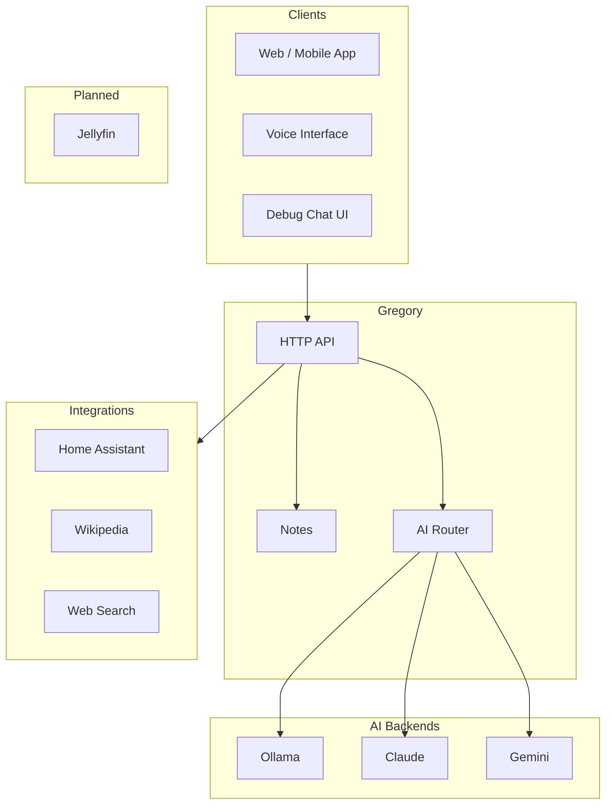
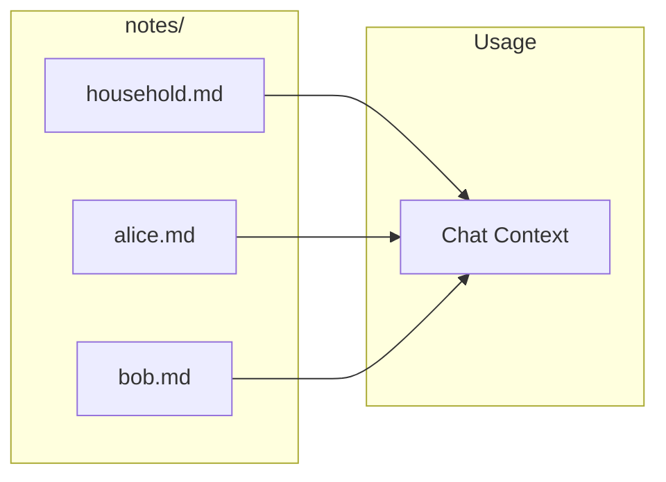

# Gregory — Smart House AI

Gregory is an AI-powered glue layer that connects various interfaces and automations. His main interface is an HTTP API for chatting, with integrations for Home Assistant, Wikipedia, web search, and multiple AI backends.

## Overview



## Features

- **HTTP API** — Chat with Gregory via REST; future apps can use this for voice, web, and more
- **User-scoped chat** — Each family member has a dedicated conversation and notes
- **Notes** — Gregory maintains Markdown notes per user and for the household
- **AI backends** — Ollama (on-prem), Claude (Anthropic), Gemini (Google) with model routing and fallback
- **Wikipedia & Web Search** — Gregory can look up facts and current information via markers in responses
- **Home Assistant** — Control lights, thermostats, and devices via natural language
- **Docker deployment** — Run on home server, Raspberry Pi, or anywhere

## Quick Start

### Docker (recommended)

1. Copy `.env.example` to `.env` and configure:
   ```bash
   cp .env.example .env
   # Edit OLLAMA_BASE_URL, FAMILY_MEMBERS, etc.
   ```

2. Run with Docker Compose:
   ```bash
   docker compose -f docker/docker-compose.yml up -d
   ```

3. Gregory will be available at `http://localhost:8000`:
   - API docs: http://localhost:8000/docs
   - Health: http://localhost:8000/health

### Local development

1. Create a virtual environment and install:
   ```bash
   python -m venv .venv
   source .venv/bin/activate   # Windows: .venv\Scripts\activate
   pip install -e ".[dev]"
   ```

2. Set environment variables (or use `.env`):
   ```bash
   export OLLAMA_BASE_URL=http://localhost:11434
   export NOTES_PATH=./notes
   export FAMILY_MEMBERS=alice,bob,kids
   ```

3. Run:
   ```bash
   uvicorn gregory.main:app --reload --host 0.0.0.0 --port 8000
   ```

### Windows (with Debug UI)

From the project root, run `run.bat`. It starts the debug UI server on port 8080 and uvicorn on port 8000. Open http://localhost:8080/chat.html to test.

## API

| Endpoint | Method | Description |
|----------|--------|-------------|
| `/health` | GET | Health check |
| `/users` | GET | List family members |
| `/users/{user_id}/chat` | POST | Send message, get response |

### Chat example

```bash
curl -X POST "http://localhost:8000/users/alice/chat" \
  -H "Content-Type: application/json" \
  -d '{"message": "Hello Gregory!"}'
```

Response:
```json
{
  "response": "Hello Alice! How can I help you today?",
  "conversation_id": "conv_1"
}
```

Interactive API documentation: http://localhost:8000/docs

### Debug Chat UI

A minimal static HTML interface for testing the chat API is in `debug/chat.html`. Serve it via HTTP to avoid CORS:

```bash
cd debug && python -m http.server 8080
```

Open http://localhost:8080/chat.html, set the API base URL and user ID, then send messages. See [docs/DEVELOPMENT.md](docs/DEVELOPMENT.md#debug-chat-ui) for details.

## Notes

Notes are stored in the `notes/` directory (or `NOTES_PATH`). In Docker, the notes volume is mounted.



- `household.md` — General household notes (shared context)
- `gregory.md` — Gregory's self-notes (his experiences, thoughts, preferences)
- `entities/*.md` — Notes about other things (pets, projects, etc.)
- `{user_id}.md` — Per-user notes (e.g. `alice.md`, `bob.md`)

Gregory reads these before each chat and can append observations as he learns. See `notes/README.md` for details. Use a bind mount to access notes from the host:

```yaml
volumes:
  - ./notes:/app/notes
```

## Configuration

| Variable | Purpose |
|----------|---------|
| `OLLAMA_BASE_URL` | Ollama server URL (e.g. `http://192.168.1.x:11434`) |
| `ANTHROPIC_API_KEY` | Anthropic API key for Claude |
| `GEMINI_API_KEY` | Google API key for Gemini |
| `AI_PROVIDER` | Preferred provider (legacy). Use `ai_providers` + `model_priority` for multi-model cost control |
| `OLLAMA_MODEL` | Ollama model (default: `llama3.2`) |
| `OBSERVATIONS_ENABLED` | Let Gregory append learned facts to notes |
| `MODEL_ROUTING_ENABLED` | Let the priority model choose which AI handles each message |
| `OLLAMA_ENSURE_MODELS` | On startup, pull missing Ollama models |
| `SYSTEM_PROMPT` | Override the base system prompt |
| `NOTES_PATH` | Path to notes directory |
| `FAMILY_MEMBERS` | Comma-separated user IDs |
| `LOG_LEVEL` | DEBUG, INFO, WARNING, ERROR |

**Local (non-Docker):** Copy `config.json.example` to `config.json` and edit. Use `.env` for API keys.

**Docker:** Use `.env` or environment variables in `docker-compose.yml`.

See [docs/CONFIGURATION.md](docs/CONFIGURATION.md) for details.

## Documentation

| Document | Description |
|----------|-------------|
| [docs/README.md](docs/README.md) | Documentation index |
| [docs/ARCHITECTURE.md](docs/ARCHITECTURE.md) | System design and data flow |
| [docs/AI_SYSTEM.md](docs/AI_SYSTEM.md) | Model routing, provider selection, and fallback |
| [docs/API.md](docs/API.md) | Detailed API reference |
| [docs/CONFIGURATION.md](docs/CONFIGURATION.md) | Environment variables |
| [docs/DEVELOPMENT.md](docs/DEVELOPMENT.md) | Local setup and code structure |
| [docs/DEPLOYMENT.md](docs/DEPLOYMENT.md) | Docker and Raspberry Pi |
| [docs/TROUBLESHOOTING.md](docs/TROUBLESHOOTING.md) | Common issues and solutions |
| [docs/ROADMAP.md](docs/ROADMAP.md) | Planned features and integrations |
| [docs/TOOLS.md](docs/TOOLS.md) | Wikipedia, web search, Home Assistant |
| [docs/KNOWN_ISSUES.md](docs/KNOWN_ISSUES.md) | Known limitations |
| [docs/STATUS.md](docs/STATUS.md) | Implementation status |
| [CONTRIBUTING.md](CONTRIBUTING.md) | How to contribute |

## Raspberry Pi

For ARM64 builds:

```bash
docker buildx build --platform linux/arm64 -t gregory:latest -f docker/Dockerfile .
```

Or build on the Pi directly (may be slow). See [docs/DEPLOYMENT.md](docs/DEPLOYMENT.md) for details.
