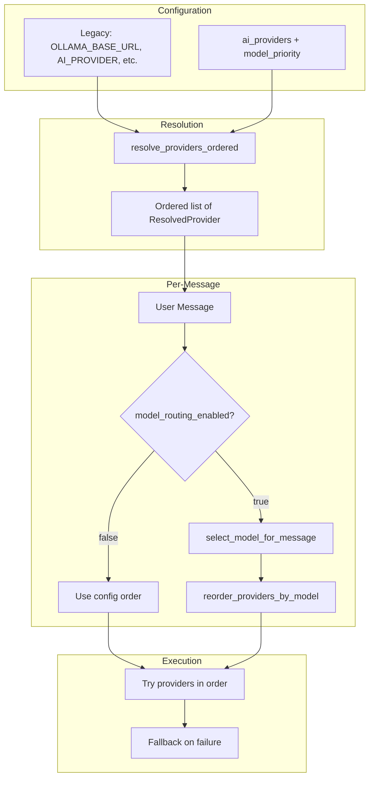
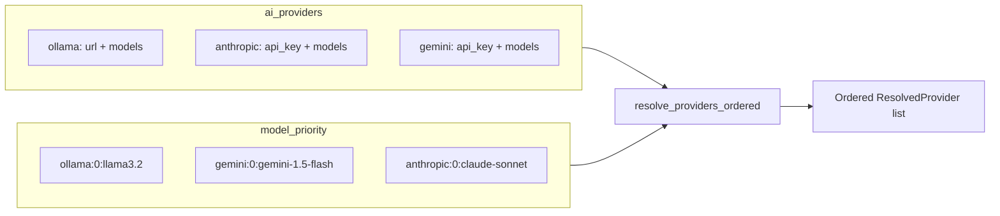
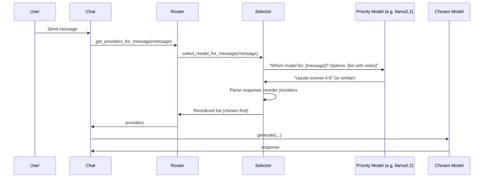
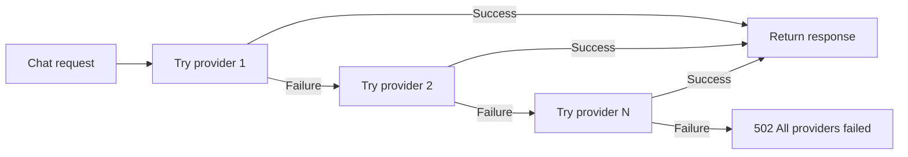

# AI System

Gregory's AI subsystem provides multi-provider support with configurable model routing and automatic fallback. This document describes how it works.

## Overview

## Provider Types

| Provider | Config Key | Requirements |
|----------|------------|--------------|
| **Ollama** | `ollama` | `url` (Ollama server URL) + `models[]` |
| **Claude (Anthropic)** | `anthropic` | `api_key` or `api_key_env` + `models[]` |
| **Gemini (Google)** | `gemini` | `api_key` or `api_key_env` + `models[]` |

## Configuration Modes

### Legacy Mode

When `ai_providers` is not set or empty, Gregory uses flat environment variables:

- `OLLAMA_BASE_URL`, `OLLAMA_MODEL`
- `ANTHROPIC_API_KEY`, `CLAUDE_MODEL`
- `GEMINI_API_KEY`, `GEMINI_MODEL`
- `AI_PROVIDER` — preferred provider when multiple are configured

Provider order: `AI_PROVIDER` first (if set), then ollama → gemini → anthropic (cheapest to most expensive).

### Multi-Provider Mode

When `ai_providers` is set, Gregory uses structured config:

1. **ai_providers** — Define endpoints/keys and their available models
2. **model_priority** — Explicit order to try models (and to offer to the selector)

Without `model_priority`, default order is: all Ollama → all Gemini → all Anthropic.

## Model Routing

When `model_routing_enabled=true` (default), Gregory uses the **highest-priority model** to decide which AI should handle each user message. This enables cost optimization: simple questions go to local/free models; complex tasks go to premium models.

### Flow

### Selection Prompt

The selector sends a short prompt to the priority model with:

- The user's message
- A list of available models and their suitability notes

The model responds with a model ID. The selector parses the response (exact match, contains, or fuzzy match) and reorders the provider list to put the chosen model first.

### Fallback

If the chosen model fails (network error, rate limit, etc.), Gregory automatically tries the next provider in the reordered list until one succeeds. If all fail, the request returns 502.

## Provider Fallback

Regardless of routing, Gregory always tries providers in order until one succeeds:

## Key Modules

| Module | Purpose |
|--------|---------|
| `ai/config.py` | `resolve_providers_ordered()` — builds ordered list from config |
| `ai/router.py` | `get_providers_for_message()` — optional routing, returns ordered providers |
| `ai/selector.py` | `select_model_for_message()` — asks priority model; `reorder_providers_by_model()` |
| `ai/providers/base.py` | `AIProvider` interface with `generate()` |
| `ai/providers/ollama.py` | Ollama HTTP API |
| `ai/providers/claude.py` | Anthropic API |
| `ai/providers/gemini.py` | Google Gemini API |

## Observations

When `observations_enabled=true`, Gregory can append learned facts to notes. The AI returns special blocks in its response:

| Block | Target |
|-------|--------|
| `[OBSERVATION: ...]` | User notes (`{user_id}.md`) |
| `[GREGORY_NOTE: ...]` | Gregory's self-notes (`gregory.md`) |
| `[HOUSEHOLD_NOTE: ...]` | Household notes (`household.md`) |
| `[NOTE:entity_id: ...]` | Entity notes (`entities/{entity_id}.md`) |

The chat route extracts these, removes them from the visible response, and appends the content to the appropriate note file. See [ARCHITECTURE.md](ARCHITECTURE.md#data-flow-notes) and [CONFIGURATION.md](CONFIGURATION.md).

## Ollama Ensure

When `ollama_ensure_models=true`, Gregory runs a background task on startup that pulls any Ollama models referenced in `ai_providers` that are not yet present on the server. This ensures the configured models are available before chat requests arrive.
