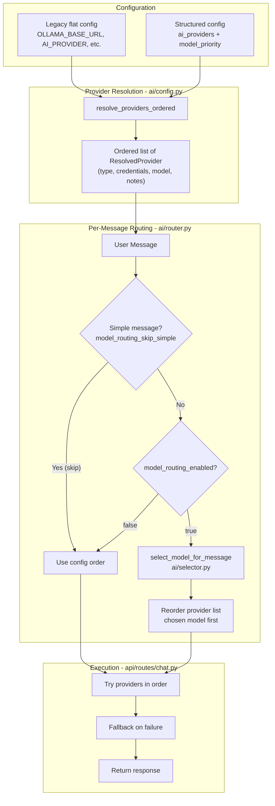
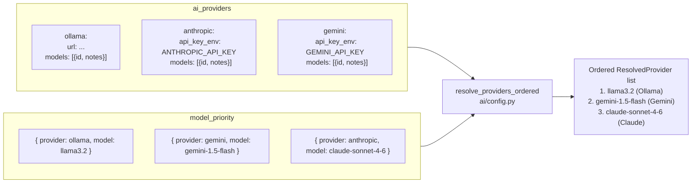
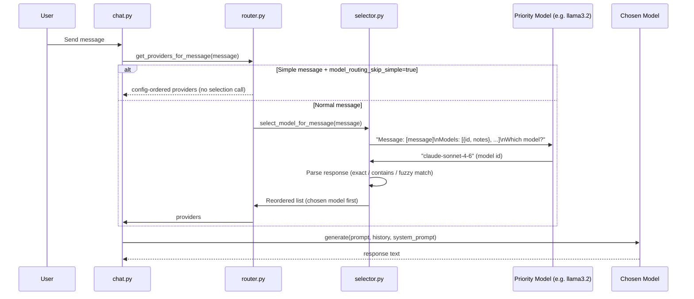
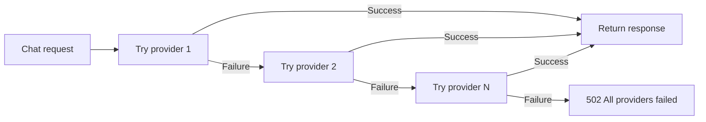

# AI System

Gregory's AI subsystem provides multi-provider support with configurable model routing and automatic fallback. This document describes how providers are configured, selected, and used for each chat request.

## Overview

```mermaid
flowchart TB
    subgraph config [Configuration]
        Legacy["Legacy flat config\nOLLAMA_BASE_URL, AI_PROVIDER, etc."]
        New["Structured config\nai_providers + model_priority"]
    end

    subgraph resolution [Provider Resolution - ai/config.py]
        Resolve[resolve_providers_ordered]
        OrderedList["Ordered list of ResolvedProvider\n(type, credentials, model, notes)"]
    end

    subgraph routing [Per-Message Routing - ai/router.py]
        Msg[User Message]
        SimpleCheck{Simple message?\nmodel_routing_skip_simple}
        Routing{model_routing_enabled?}
        ConfigOrder[Use config order]
        Select[select_model_for_message\nai/selector.py]
        Reorder[Reorder provider list\nchosen model first]
    end

    subgraph execution [Execution - api/routes/chat.py]
        Try[Try providers in order]
        Fallback[Fallback on failure]
        Result[Return response]
    end

    Legacy --> Resolve
    New --> Resolve
    Resolve --> OrderedList
    OrderedList --> Msg
    Msg --> SimpleCheck
    SimpleCheck -->|"Yes (skip)"| ConfigOrder
    SimpleCheck -->|No| Routing
    Routing -->|false| ConfigOrder
    Routing -->|true| Select
    Select --> Reorder
    ConfigOrder --> Try
    Reorder --> Try
    Try --> Fallback
    Fallback --> Result
```

## Provider Types

| Provider | Config Key | Requirements |
|----------|------------|--------------|
| **Ollama** | `ollama` | `url` (Ollama server URL) + `models[]` |
| **Claude (Anthropic)** | `anthropic` | `api_key` or `api_key_env` + `models[]` |
| **Gemini (Google)** | `gemini` | `api_key` or `api_key_env` + `models[]` |

## Configuration Modes

### Legacy Mode

When `ai_providers` is not set or empty, Gregory uses flat environment variables:

- `OLLAMA_BASE_URL`, `OLLAMA_MODEL`
- `ANTHROPIC_API_KEY`, `CLAUDE_MODEL`
- `GEMINI_API_KEY`, `GEMINI_MODEL`
- `AI_PROVIDER` — preferred provider when multiple are configured

Provider order: `AI_PROVIDER` first (if set), then ollama → gemini → anthropic (cheapest to most expensive).

### Multi-Provider Mode

When `ai_providers` is set in `config.json`, Gregory uses structured multi-endpoint configuration:

1. **ai_providers** — Define endpoints/keys and their available models with `notes` describing each model's strengths
2. **model_priority** — Explicit order to try models (and present to the selector)

Without `model_priority`, default order is: all Ollama → all Gemini → all Anthropic.

```mermaid
flowchart LR
    subgraph ap [ai_providers]
        O["ollama:\n  url: ...\n  models: [{id, notes}]"]
        A["anthropic:\n  api_key_env: ANTHROPIC_API_KEY\n  models: [{id, notes}]"]
        G["gemini:\n  api_key_env: GEMINI_API_KEY\n  models: [{id, notes}]"]
    end

    subgraph mp [model_priority]
        E1["{ provider: ollama, model: llama3.2 }"]
        E2["{ provider: gemini, model: gemini-1.5-flash }"]
        E3["{ provider: anthropic, model: claude-sonnet-4-6 }"]
    end

    ap --> Resolve[resolve_providers_ordered\nai/config.py]
    mp --> Resolve
    Resolve --> List["Ordered ResolvedProvider list\n1. llama3.2 (Ollama)\n2. gemini-1.5-flash (Gemini)\n3. claude-sonnet-4-6 (Claude)"]
```

## Model Routing

When `model_routing_enabled=true` (default), Gregory uses the **highest-priority model** to decide which AI should handle each user message. This enables cost optimization: simple questions go to local/free models; complex tasks go to premium models.

### Simple Message Bypass

When `model_routing_skip_simple=true` (default), short acknowledgment messages ("ok", "thanks", "yes", greetings) skip the routing step entirely. This avoids the latency and cost of an extra AI call just to route a trivial response.

### Model Selection Provider

By default, the selector uses the first (highest-priority) model to make its routing decision. You can override this with `model_selection_provider`:

- `model_selection_provider=ollama` — always use Ollama for selection (free, regardless of priority order)
- `model_selection_provider=anthropic` — always use Anthropic for selection
- `model_selection_provider=gemini` — always use Gemini for selection

### Full Routing Flow

```mermaid
sequenceDiagram
    participant User
    participant Chat as chat.py
    participant Router as router.py
    participant Selector as selector.py
    participant PriorityModel as Priority Model (e.g. llama3.2)
    participant ChosenModel as Chosen Model

    User->>Chat: Send message
    Chat->>Router: get_providers_for_message(message)

    alt Simple message + model_routing_skip_simple=true
        Router-->>Chat: config-ordered providers (no selection call)
    else Normal message
        Router->>Selector: select_model_for_message(message)
        Selector->>PriorityModel: "Message: [message]\nModels: [{id, notes}, ...]\nWhich model?"
        PriorityModel->>Selector: "claude-sonnet-4-6" (model id)
        Selector->>Selector: Parse response (exact / contains / fuzzy match)
        Selector->>Router: Reordered list (chosen model first)
        Router->>Chat: providers
    end

    Chat->>ChosenModel: generate(prompt, history, system_prompt)
    ChosenModel-->>Chat: response text
```

### Selection Prompt

The selector sends a short prompt to the priority model containing:
- The user's message
- A list of available models and their `notes` (suitability descriptions)

The model responds with a model ID. The selector parses the response using three strategies in order:
1. **Exact match** — response exactly equals a model ID
2. **Contains match** — response contains a known model ID as a substring
3. **Fuzzy match** — normalized Levenshtein/SequenceMatcher similarity ≥ 0.6

If no model can be parsed, the default config order is used.

## Provider Fallback

Regardless of routing, Gregory always tries providers in order until one succeeds:

```mermaid
flowchart LR
    Start[Chat request] --> P1[Try provider 1]
    P1 -->|Success| Done[Return response]
    P1 -->|Failure| P2[Try provider 2]
    P2 -->|Success| Done
    P2 -->|Failure| P3[Try provider N]
    P3 -->|Success| Done
    P3 -->|Failure| Error[502 All providers failed]
```

**Retry within a provider:** Set `PROVIDER_RETRY_COUNT` (0–3, default 0) to retry transient errors (timeout, 429, 503) within a single provider before moving to the next. Uses exponential backoff (1s, 2s, 4s).

## Provider Implementations

Each provider wraps a different API but presents the same `generate()` interface:

| Module | API | Notes |
|--------|-----|-------|
| `ai/providers/ollama.py` | POST `/api/chat` (REST) | System prompt as first message |
| `ai/providers/claude.py` | Anthropic Messages API | System prompt as top-level `system` param |
| `ai/providers/gemini.py` | Google Gen AI SDK (async) | System as `GenerateContentConfig.system_instruction`; roles: "user"/"model" |

All providers:
- Accept the same `(prompt, history, system_context)` signature
- Return plain text string (stripped)
- Use `_retry_async()` from `base.py` for transient error retries

## Follow-up Calls

When the AI response contains skill markers (Wikipedia, web search, Home Assistant), a second AI call is made after tool execution with the results injected into the system prompt. This follow-up call:

1. Uses the **same provider** that succeeded in the primary call by default
2. Can be routed to **Ollama first** via `FOLLOW_UP_PREFER_OLLAMA=true` to reduce cost for synthesis steps
3. Falls back to the original provider if the preferred follow-up provider fails

## Observations

When `observations_enabled=true`, Gregory can append learned facts to notes. The AI returns special blocks in its response:

| Block | Target |
|-------|--------|
| `[OBSERVATION: ...]` | User notes (`{user_id}.md`) |
| `[GREGORY_NOTE: ...]` | Gregory's self-notes (`gregory.md`) |
| `[HOUSEHOLD_NOTE: ...]` | Household notes (`household.md`) |
| `[NOTE:entity_id: ...]` | Entity notes (`entities/{entity_id}.md`) |

The chat route extracts these, removes them from the visible response, and appends the content to the appropriate note file. See [ARCHITECTURE.md](ARCHITECTURE.md#notes-system-data-flow) and [CONFIGURATION.md](CONFIGURATION.md).

## Ollama Ensure

When `ollama_ensure_models=true`, Gregory runs a background task on startup that pulls any Ollama models referenced in `ai_providers` that are not yet present on the server. This runs asynchronously and does not block the server from accepting requests.

## Key Modules

| Module | Purpose |
|--------|---------|
| `ai/config.py` | `resolve_providers_ordered()` — builds ordered `ResolvedProvider` list from config |
| `ai/router.py` | `get_providers_for_message()` — optional routing, returns ordered `(name, provider)` list |
| `ai/selector.py` | `select_model_for_message()` — asks priority model; `reorder_providers_by_model()` |
| `ai/prompts.py` | `build_system_prompt()` — assembles system prompt from base + notes + skill instructions |
| `ai/observations.py` | `extract_memory_markers()` — parses all markers from AI response |
| `ai/providers/base.py` | `AIProvider` ABC + `_retry_async()` transient retry logic |
| `ai/providers/ollama.py` | Ollama HTTP REST API |
| `ai/providers/claude.py` | Anthropic Messages API |
| `ai/providers/gemini.py` | Google Gen AI SDK |
