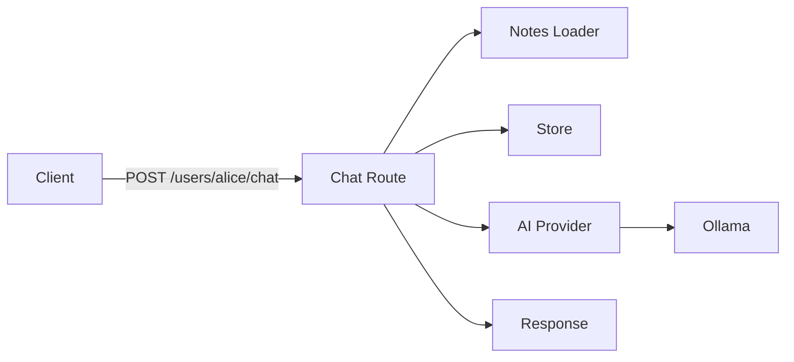

# API Reference

Gregory exposes an HTTP API. Interactive documentation is available at `/docs` when the server is running.

## Base URL

- Local: `http://localhost:8000`
- Docker: `http://localhost:8000` (or your host)

## Endpoints

### Root

**GET /**

Returns service info and links.

**Response:**
```json
{
  "name": "Gregory",
  "description": "Smart House AI",
  "docs": "/docs",
  "health": "/health"
}
```

---

### Health Check

**GET /health**

Health check for Docker, load balancers, and monitoring. Indicates whether Ollama is configured.

**Response:**
```json
{
  "status": "ok",
  "ollama_configured": true
}
```

| Field | Type | Description |
|-------|------|-------------|
| status | string | Always `"ok"` when healthy |
| ollama_configured | boolean | `true` if `OLLAMA_BASE_URL` is set |

---

### List Users

**GET /users**

Returns the list of known family members. Combines `FAMILY_MEMBERS` from config and user IDs from the notes directory.

**Response:**
```json
{
  "users": ["alice", "bob", "kids"]
}
```

| Field | Type | Description |
|-------|------|-------------|
| users | string[] | Sorted list of user IDs |

---

### Chat

**POST /users/{user_id}/chat**

Send a message as the specified user and receive Gregory's response. Each user has a single unified conversation history.

**Path Parameters:**

| Parameter | Type | Description |
|-----------|------|-------------|
| user_id | string | Family member identifier (lowercase, alphanumeric + `-` and `_`) |

**Request Body:**
```json
{
  "message": "Hello Gregory!"
}
```

| Field | Type | Constraints | Description |
|-------|------|-------------|-------------|
| message | string | 1–16384 chars | The user's message |

**Response:**
```json
{
  "response": "Hello Alice! How can I help you today?",
  "conversation_id": "conv_1"
}
```

| Field | Type | Description |
|-------|------|-------------|
| response | string | Gregory's reply |
| conversation_id | string | Stable ID for this user's conversation |

**Error Responses:**

| Status | Condition |
|--------|-----------|
| 400 | Invalid `user_id` |
| 502 | AI provider error |
| 503 | No AI provider configured (e.g. `OLLAMA_BASE_URL` not set) |

---

## Request Flow


