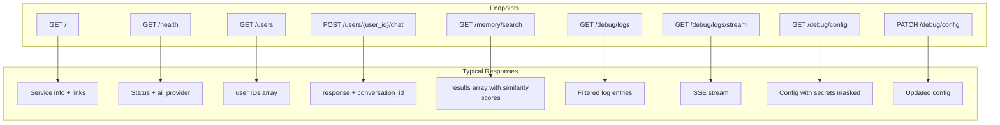
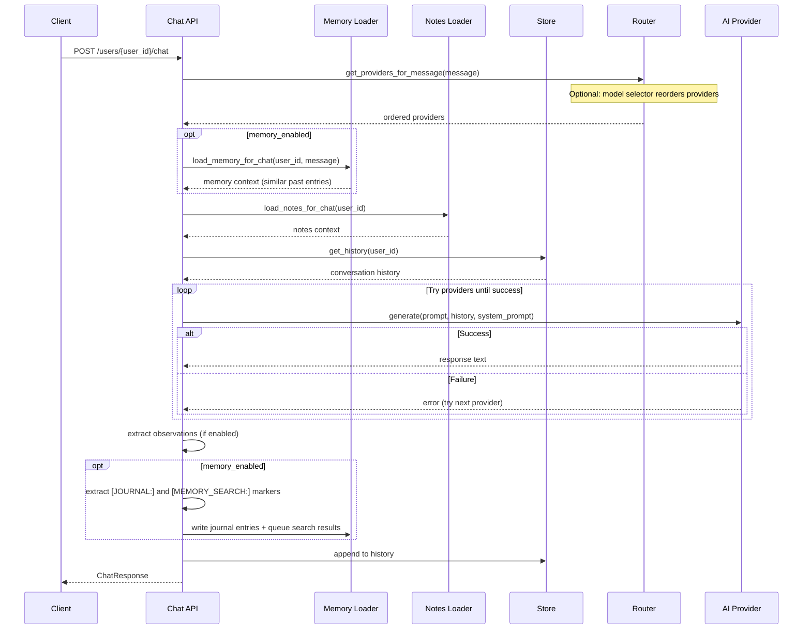

# API Reference

Gregory exposes an HTTP API for chat, user management, and health checks. Interactive documentation (Swagger UI) is available at `/docs` when the server is running.

## Base URL

- Local: `http://localhost:8000`
- Docker: `http://localhost:8000` (or your host)

## API Overview



## Endpoints

### Root

**GET /**

Returns service info and links.

**Response:**
```json
{
  "name": "Gregory",
  "description": "Smart House AI",
  "docs": "/docs",
  "health": "/health"
}
```

---

### Health Check

**GET /health**

Health check for Docker, load balancers, and monitoring. Indicates which AI provider is primary (first in the configured order).

**Response:**
```json
{
  "status": "ok",
  "ollama_configured": true,
  "ai_provider": "ollama"
}
```

| Field | Type | Description |
|-------|------|-------------|
| status | string | Always `"ok"` when healthy |
| ollama_configured | boolean | `true` if `OLLAMA_BASE_URL` is set (legacy) or an Ollama endpoint exists in `ai_providers` |
| ai_provider | string \| null | Primary provider: `claude`, `gemini`, or `ollama`; `null` if none configured |

**Note:** When using `ai_providers` and `model_priority`, multiple providers may be configured. The `ai_provider` field reflects the *primary* (first) provider in the resolved order. See [AI System](AI_SYSTEM.md) for model routing and fallback behavior.

---

### List Users

**GET /users**

Returns the list of known family members. Combines `FAMILY_MEMBERS` from config and user IDs from the notes directory.

**Response:**
```json
{
  "users": ["alice", "bob", "kids"]
}
```

| Field | Type | Description |
|-------|------|-------------|
| users | string[] | Sorted list of user IDs |

---

### Chat

**POST /users/{user_id}/chat**

Send a message as the specified user and receive Gregory's response. Each user has a single unified conversation history.

**Path Parameters:**

| Parameter | Type | Description |
|-----------|------|-------------|
| user_id | string | Family member identifier (lowercase, alphanumeric + `-` and `_`) |

**Request Body:**
```json
{
  "message": "Hello Gregory!"
}
```

| Field | Type | Constraints | Description |
|-------|------|-------------|-------------|
| message | string | 1–16384 chars | The user's message |

**Response:**
```json
{
  "response": "Hello Alice! How can I help you today?",
  "conversation_id": "conv_1"
}
```

| Field | Type | Description |
|-------|------|-------------|
| response | string | Gregory's reply |
| conversation_id | string | Stable ID for this user's conversation |

**Error Responses:**

| Status | Condition |
|--------|-----------|
| 400 | Invalid `user_id` |
| 502 | AI provider error |
| 503 | No AI provider configured (e.g. `OLLAMA_BASE_URL` not set) |

---

### Memory Search

**GET /memory/search**

Search Gregory's memory journal using a natural language query. Requires `MEMORY_ENABLED=true`.

**Query Parameters:**

| Parameter | Type | Default | Description |
|-----------|------|---------|-------------|
| q | string | required | Search query |
| top_k | integer | `5` | Maximum number of results |

**Response:**
```json
{
  "query": "thermostat preferences",
  "results": [
    {
      "text": "- [14:23 UTC | alice] Alice asked to set thermostat to 22°C",
      "metadata": {
        "date": "2026-02-27",
        "user_id": "alice",
        "type": "entry"
      },
      "similarity": 0.91
    }
  ]
}
```

| Field | Type | Description |
|-------|------|-------------|
| query | string | The query that was searched |
| results | array | Matching memory entries, ordered by similarity (descending) |
| results[].text | string | The journal entry text |
| results[].metadata.date | string | ISO date of the entry (`YYYY-MM-DD`) |
| results[].metadata.user_id | string | User who triggered the entry (empty for system entries) |
| results[].metadata.type | string | `entry`, `summary`, or `compressed` |
| results[].similarity | number | Cosine similarity (0–1); 1 = identical |

**Error Responses:**

| Status | Condition |
|--------|-----------|
| 503 | Memory system is disabled (`MEMORY_ENABLED=false`) |

**Note:** This endpoint uses `threshold=0.0` so it always returns up to `top_k` results regardless of similarity, ordered by relevance. This is useful for inspection and debugging. The pre-chat auto-search uses `MEMORY_SIMILARITY_THRESHOLD` to filter low-confidence results.

---

### Debug API

Debug endpoints support the debug UI (`debug/chat.html`, `debug/config.html`, `debug/logging.html`). Serve the debug UI over HTTP to avoid CORS (e.g. `python -m http.server 8080` from the `debug/` directory).

#### Get Logs

**GET /debug/logs**

Return recent log entries. Filter by level and/or substring.

**Query Parameters:**

| Parameter | Type | Default | Description |
|-----------|------|---------|-------------|
| levels | string | — | Comma-separated: `DEBUG`, `INFO`, `WARNING`, `ERROR` |
| substring | string | — | Filter messages containing this string |
| limit | integer | `500` | Maximum number of entries (1–2000) |

**Response:** Array of log entry objects with `level`, `message`, `logger`, `timestamp`, etc.

---

#### Stream Logs

**GET /debug/logs/stream**

Server-Sent Events stream of new log entries. Useful for live log viewing in the debug UI.

**Response:** `text/event-stream` — each event is a JSON log entry.

---

#### Get Config

**GET /debug/config**

Return `config.json` contents with secrets masked (`[SET]` or `[NOT SET]`). For config viewer in debug UI.

**Response:** JSON object (config with masked values). Returns `{}` if config file does not exist.

---

#### Patch Config

**PATCH /debug/config**

Update `config.json` with the request body. Secrets sent as `[SET]` or `[MASKED]` are preserved from the existing config. Clears the settings cache so subsequent requests use the new values.

**Request Body:** JSON object (partial or full config).

**Response:** Updated config with secrets masked.

**Note:** Changes to some settings (e.g. `ai_providers`, `memory_enabled`) may require a server restart to take full effect.

---

## Chat Request Flow


