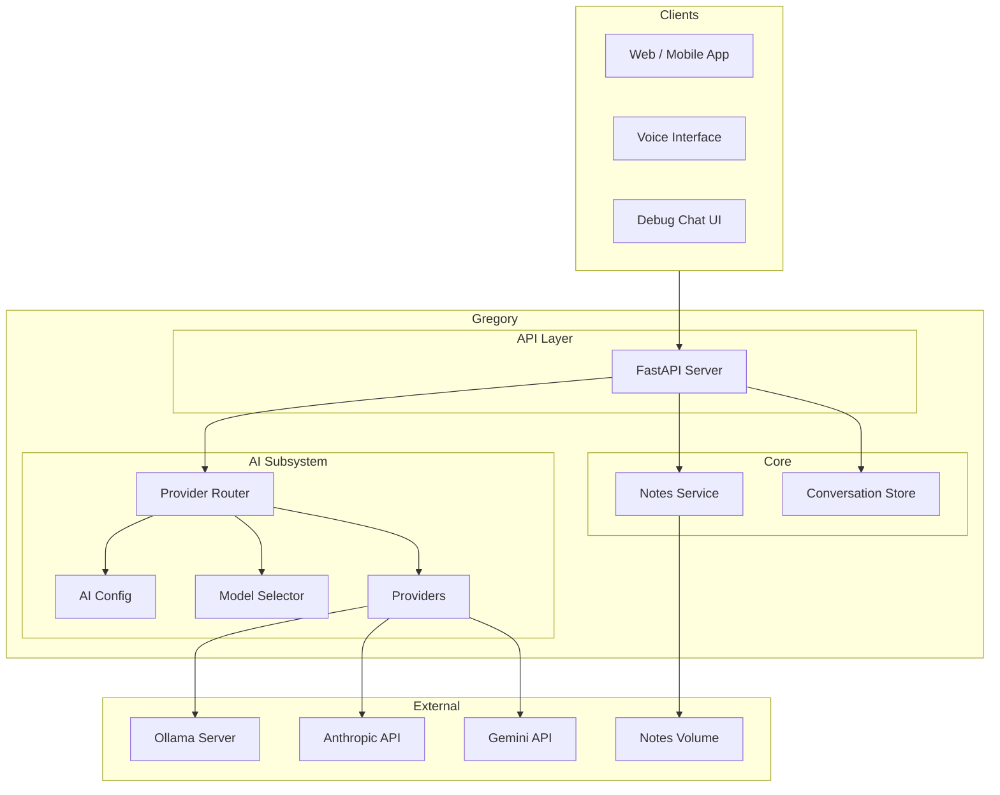
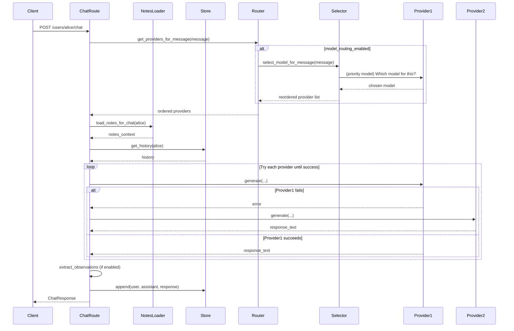
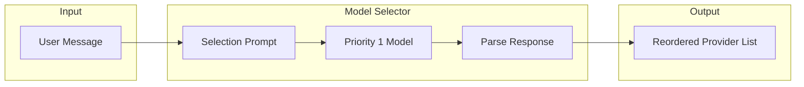
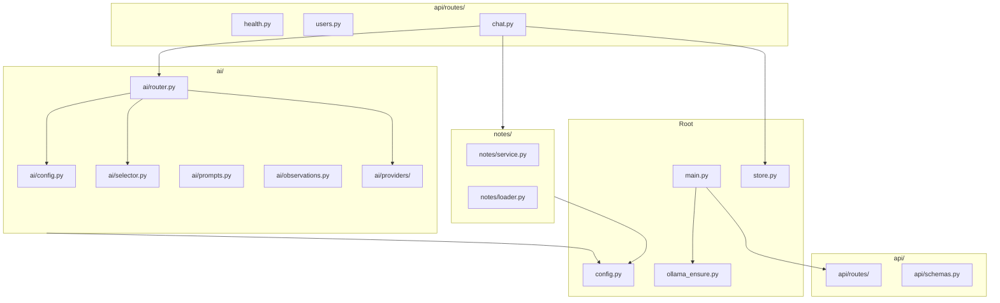
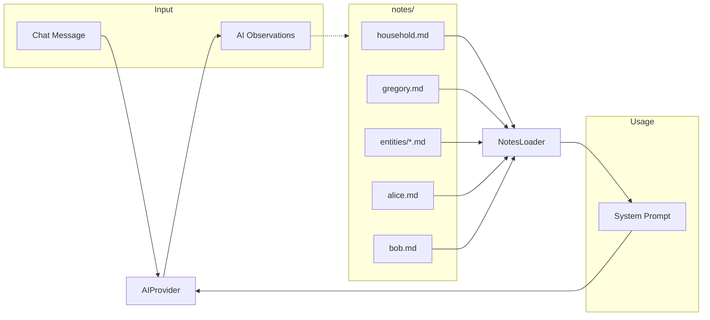
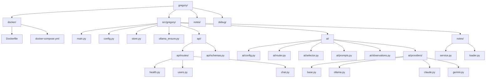

# Architecture

## Overview

Gregory is an HTTP API layer that connects clients to AI backends (Ollama, Claude, Gemini), notes, and (future) integrations like Home Assistant and Jellyfin. It supports multi-provider configuration with model routing and automatic fallback.

## Request Flow: Chat

The chat flow loads notes, optionally consults the model selector for routing, then tries providers in order until one succeeds.

## Model Routing Flow

When `model_routing_enabled=true`, the highest-priority model decides which AI handles each message. This reduces cost by steering simple tasks to local/free models.

## Component Diagram

## Data Flow: Notes

**Note:** The dotted line from AI to notes is implemented when `OBSERVATIONS_ENABLED=true`. Gregory extracts observation blocks and routes them: `[OBSERVATION: ...]` → user, `[GREGORY_NOTE: ...]` → gregory.md, `[HOUSEHOLD_NOTE: ...]` → household, `[NOTE:entity: ...]` → entities/. See [CONFIGURATION.md](CONFIGURATION.md).

## Project Structure

