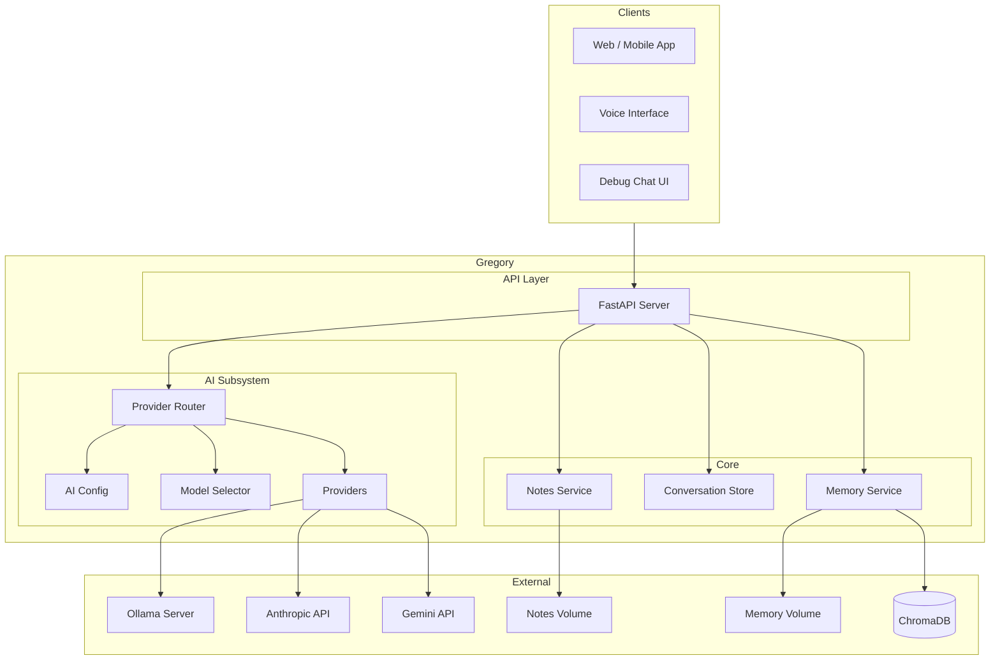
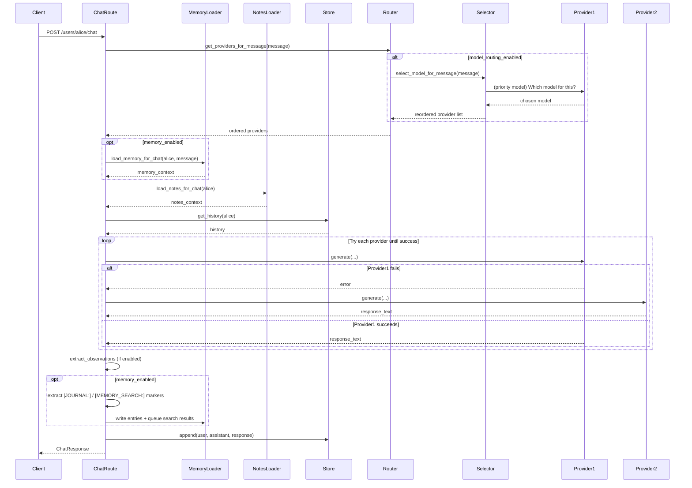
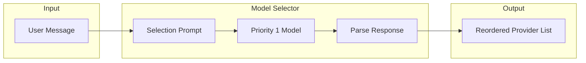
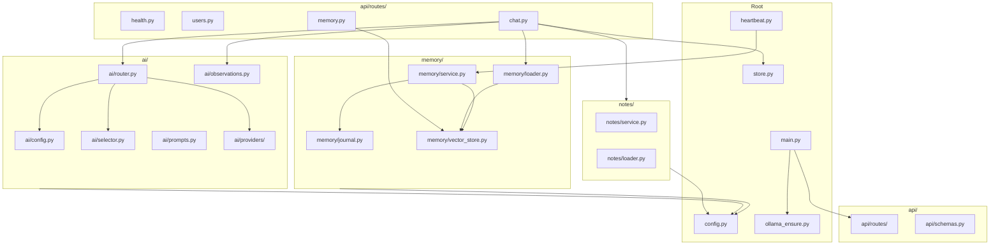
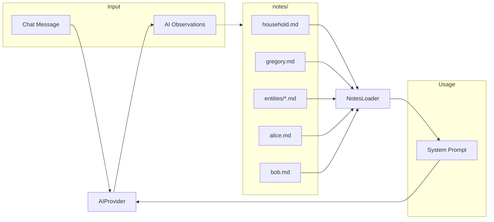
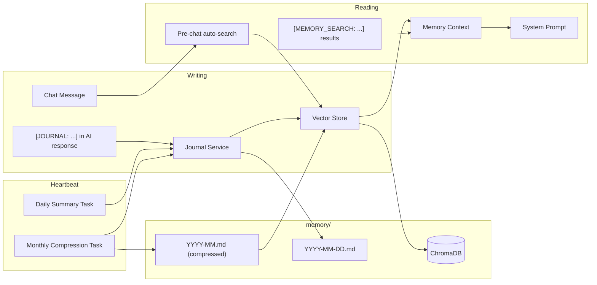

# Architecture

## Overview

Gregory is an HTTP API layer that connects clients to AI backends (Ollama, Claude, Gemini), notes, and (future) integrations like Home Assistant and Jellyfin. It supports multi-provider configuration with model routing and automatic fallback. An optional memory system provides persistent journal storage and semantic retrieval.

## Request Flow: Chat

The chat flow loads notes and memory context, optionally consults the model selector for routing, then tries providers in order until one succeeds.

## Model Routing Flow

When `model_routing_enabled=true`, the highest-priority model decides which AI handles each message. This reduces cost by steering simple tasks to local/free models.

## Component Diagram

## Data Flow: Notes

**Note:** The dotted line from AI to notes is implemented when `OBSERVATIONS_ENABLED=true`. Gregory extracts observation blocks and routes them: `[OBSERVATION: ...]` → user, `[GREGORY_NOTE: ...]` → gregory.md, `[HOUSEHOLD_NOTE: ...]` → household, `[NOTE:entity: ...]` → entities/. See [CONFIGURATION.md](CONFIGURATION.md).

## Data Flow: Memory

**Note:** The memory system is optional (`MEMORY_ENABLED=true`). It complements notes with temporal, event-driven entries written automatically during conversations. See [MEMORY.md](MEMORY.md) for full details.

## Project Structure

```mermaid
flowchart TD
    root[gregory/]
    docker[docker/]
    src[src/gregory/]
    notes[notes/]
    memory_dir[memory/]
    tests_dir[tests/]
    debug[debug/]

    root --> docker
    root --> src
    root --> notes
    root --> memory_dir
    root --> tests_dir
    root --> debug

    docker --> Dockerfile[Dockerfile]
    docker --> compose[docker-compose.yml]

    src --> main[main.py]
    src --> config[config.py]
    src --> store[store.py]
    src --> heartbeat[heartbeat.py]
    src --> ollama_ensure[ollama_ensure.py]
    src --> api[api/]
    src --> ai[ai/]
    src --> notes_src[notes/]
    src --> memory_src[memory/]

    api --> routes[api/routes/]
    api --> schemas[api/schemas.py]
    routes --> health[health.py]
    routes --> users[users.py]
    routes --> chat[chat.py]
    routes --> mem_route[memory.py]

    ai --> config_ai[ai/config.py]
    ai --> router[ai/router.py]
    ai --> selector[ai/selector.py]
    ai --> prompts[ai/prompts.py]
    ai --> observations[ai/observations.py]
    ai --> providers[ai/providers/]

    providers --> base[base.py]
    providers --> ollama[ollama.py]
    providers --> claude[claude.py]
    providers --> gemini[gemini.py]

    notes_src --> service[service.py]
    notes_src --> loader[loader.py]

    memory_src --> journal[journal.py]
    memory_src --> vector_store[vector_store.py]
    memory_src --> mem_service[service.py]
    memory_src --> mem_loader[loader.py]
```

