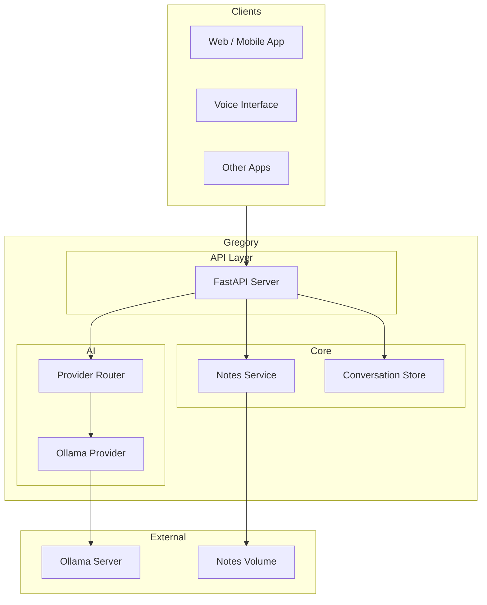
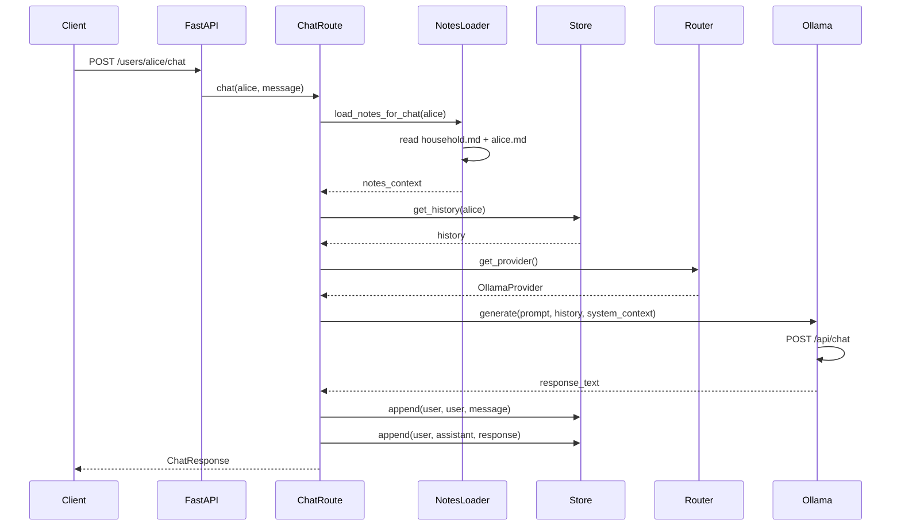
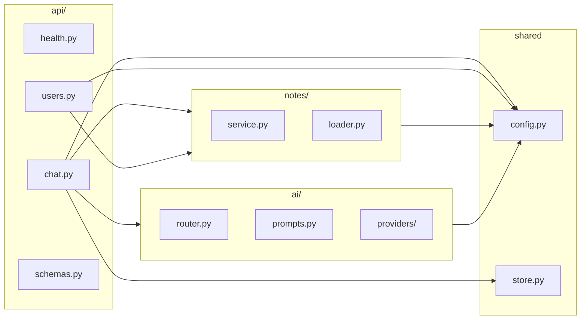
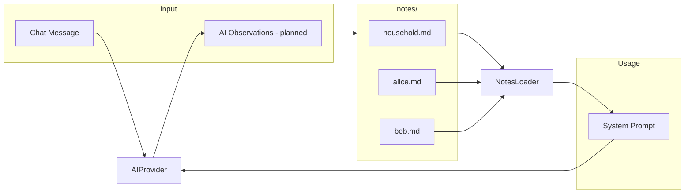
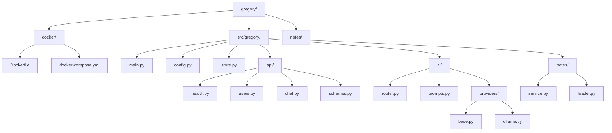

# Architecture

## Overview

Gregory is an HTTP API layer that connects clients to AI backends, notes, and (future) integrations like Home Assistant and Jellyfin.

## Request Flow: Chat

## Component Diagram

## Data Flow: Notes

**Note:** The dotted line from AI to notes represents **planned** functionality: Gregory will eventually be able to append observations to notes as he learns. This is not yet implemented. See [ROADMAP.md](ROADMAP.md).

## Project Structure

