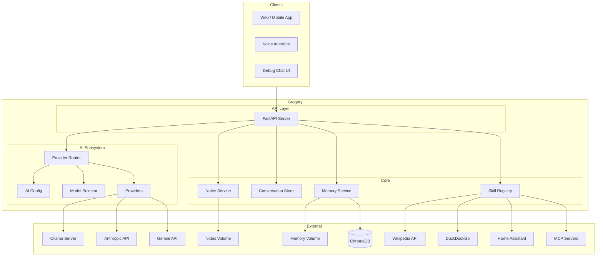
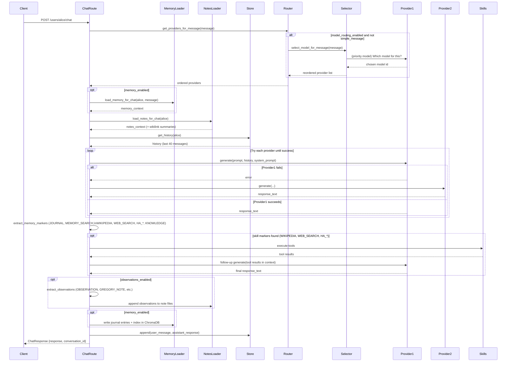
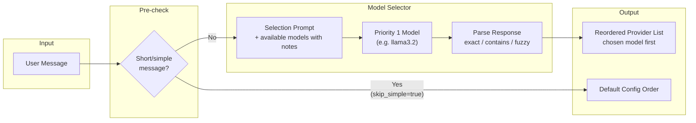
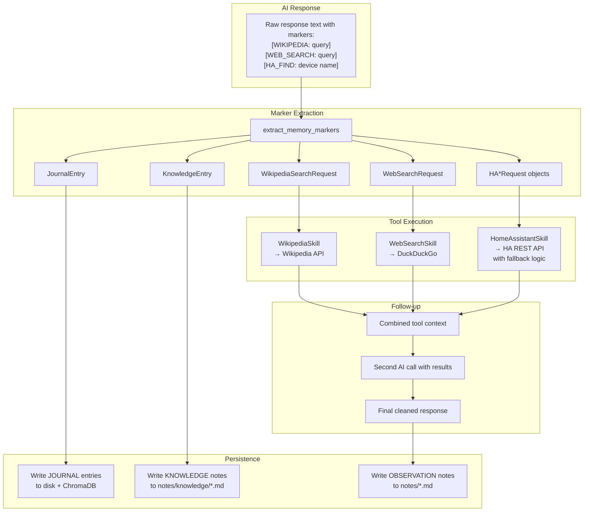
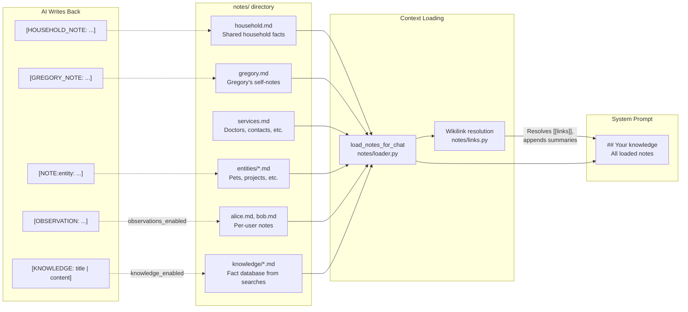
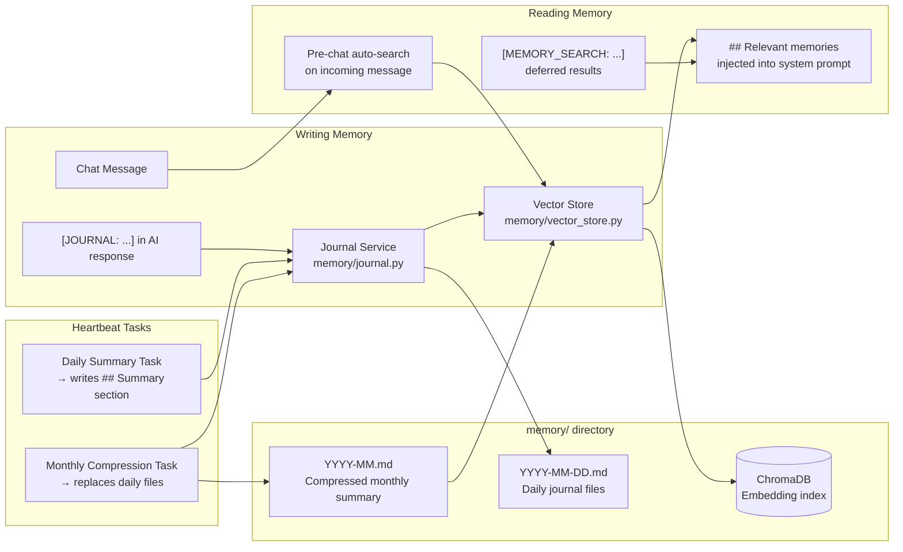

# Architecture

## Overview

Gregory is an HTTP API layer that connects clients to AI backends (Ollama, Claude, Gemini), a notes system, tools/skills, and an optional memory system. It supports multi-provider configuration with model routing and automatic fallback. An extensible skill registry lets the AI invoke tools (Wikipedia, web search, Home Assistant, and any MCP server tools) by embedding special markers in its responses.


```mermaid
flowchart TB
    subgraph clients [Clients]
        WebApp[Web / Mobile App]
        VoiceInterface[Voice Interface]
        DebugUI[Debug Chat UI]
    end

    subgraph gregory [Gregory]
        subgraph api [API Layer]
            FastAPI[FastAPI Server]
        end
        subgraph core [Core]
            Notes[Notes Service]
            Store[Conversation Store]
            Memory[Memory Service]
            Skills[Skill Registry]
        end
        subgraph ai [AI Subsystem]
            Config[AI Config]
            Router[Provider Router]
            Selector[Model Selector]
            Providers[Providers]
        end
    end

    subgraph external [External]
        OllamaServer[Ollama Server]
        Anthropic[Anthropic API]
        Gemini[Gemini API]
        NotesVolume[Notes Volume]
        MemoryVolume[Memory Volume]
        ChromaDB[(ChromaDB)]
        Wikipedia[Wikipedia API]
        DuckDuckGo[DuckDuckGo]
        HomeAssistant[Home Assistant]
        MCPServers[MCP Servers]
    end

    clients --> FastAPI
    FastAPI --> Notes
    FastAPI --> Store
    FastAPI --> Memory
    FastAPI --> Skills
    FastAPI --> Router
    Router --> Config
    Router --> Selector
    Router --> Providers
    Providers --> OllamaServer
    Providers --> Anthropic
    Providers --> Gemini
    Notes --> NotesVolume
    Memory --> MemoryVolume
    Memory --> ChromaDB
    Skills --> Wikipedia
    Skills --> DuckDuckGo
    Skills --> HomeAssistant
    Skills --> MCPServers
```

## Request Flow: Chat

The chat flow loads notes and memory context, optionally consults the model selector for routing, then tries providers in order until one succeeds. If the AI response contains skill markers ([WIKIPEDIA:], [WEB_SEARCH:], [HA_*:]), those tools are executed and a follow-up AI call returns the final answer.


```mermaid
sequenceDiagram
    participant Client
    participant ChatRoute
    participant MemoryLoader
    participant NotesLoader
    participant Store
    participant Router
    participant Selector
    participant Provider1
    participant Provider2
    participant Skills

    Client->>ChatRoute: POST /users/alice/chat
    ChatRoute->>Router: get_providers_for_message(message)
    alt model_routing_enabled and not simple_message
        Router->>Selector: select_model_for_message(message)
        Selector->>Provider1: (priority model) Which model for this?
        Provider1-->>Selector: chosen model id
        Selector-->>Router: reordered provider list
    end
    Router-->>ChatRoute: ordered providers

    opt memory_enabled
        ChatRoute->>MemoryLoader: load_memory_for_chat(alice, message)
        MemoryLoader-->>ChatRoute: memory_context
    end
    ChatRoute->>NotesLoader: load_notes_for_chat(alice)
    NotesLoader-->>ChatRoute: notes_context (+ wikilink summaries)
    ChatRoute->>Store: get_history(alice)
    Store-->>ChatRoute: history (last 40 messages)

    loop Try each provider until success
        ChatRoute->>Provider1: generate(prompt, history, system_prompt)
        alt Provider1 fails
            Provider1-->>ChatRoute: error
            ChatRoute->>Provider2: generate(...)
            Provider2-->>ChatRoute: response_text
        else Provider1 succeeds
            Provider1-->>ChatRoute: response_text
        end
    end

    ChatRoute->>ChatRoute: extract_memory_markers (JOURNAL, MEMORY_SEARCH,\nWIKIPEDIA, WEB_SEARCH, HA_*, KNOWLEDGE)

    opt skill markers found (WIKIPEDIA, WEB_SEARCH, HA_*)
        ChatRoute->>Skills: execute tools
        Skills-->>ChatRoute: tool results
        ChatRoute->>Provider1: follow-up generate(tool results in context)
        Provider1-->>ChatRoute: final response_text
    end

    opt observations_enabled
        ChatRoute->>ChatRoute: extract_observations (OBSERVATION, GREGORY_NOTE, etc.)
        ChatRoute->>NotesLoader: append observations to note files
    end

    opt memory_enabled
        ChatRoute->>MemoryLoader: write journal entries + index in ChromaDB
    end

    ChatRoute->>Store: append(user_message, assistant_response)
    ChatRoute-->>Client: ChatResponse {response, conversation_id}
```

## Model Routing Flow

When `model_routing_enabled=true`, the highest-priority model decides which AI handles each message. This reduces cost by steering simple tasks to local/free models and complex tasks to premium models. Simple messages (greetings, short acknowledgments) skip routing entirely when `model_routing_skip_simple=true`.


```mermaid
flowchart LR
    subgraph input [Input]
        Message[User Message]
    end

    subgraph check [Pre-check]
        Simple{Short/simple\nmessage?}
    end

    subgraph selector [Model Selector]
        Priority1["Priority 1 Model\n(e.g. llama3.2)"]
        Prompt[Selection Prompt\n+ available models with notes]
        Parse[Parse Response\nexact / contains / fuzzy]
    end

    subgraph output [Output]
        Reordered[Reordered Provider List\nchosen model first]
        Default[Default Config Order]
    end

    Message --> Simple
    Simple -->|"Yes\n(skip_simple=true)"| Default
    Simple --> |No| Prompt
    Prompt --> Priority1
    Priority1 --> Parse
    Parse --> Reordered
```

## Skill Execution Flow

Skills are invoked when the AI embeds special markers in its response. After the primary AI call, markers are extracted, tools are executed in parallel, results are assembled into context, and a follow-up AI call produces the final answer with real data.


```mermaid
flowchart TB
    subgraph response [AI Response]
        Raw["Raw response text with markers:\n[WIKIPEDIA: query]\n[WEB_SEARCH: query]\n[HA_FIND: device name]"]
    end

    subgraph extraction [Marker Extraction]
        Extract[extract_memory_markers]
        Wiki[WikipediaSearchRequest]
        Web[WebSearchRequest]
        HA[HA*Request objects]
        Journal[JournalEntry]
        Knowledge[KnowledgeEntry]
    end

    subgraph execution [Tool Execution]
        WikiSkill[WikipediaSkill\n→ Wikipedia API]
        WebSkill[WebSearchSkill\n→ DuckDuckGo]
        HASkill[HomeAssistantSkill\n→ HA REST API\nwith fallback logic]
    end

    subgraph followup [Follow-up]
        Context[Combined tool context]
        AICall[Second AI call with results]
        Final[Final cleaned response]
    end

    subgraph persist [Persistence]
        JournalWrite[Write JOURNAL entries\nto disk + ChromaDB]
        KnowledgeWrite[Write KNOWLEDGE notes\nto notes/knowledge/*.md]
        ObsWrite[Write OBSERVATION notes\nto notes/*.md]
    end

    Raw --> Extract
    Extract --> Wiki & Web & HA & Journal & Knowledge
    Wiki --> WikiSkill
    Web --> WebSkill
    HA --> HASkill
    WikiSkill & WebSkill & HASkill --> Context
    Context --> AICall
    AICall --> Final
    Journal --> JournalWrite
    Knowledge --> KnowledgeWrite
    Final --> ObsWrite
```

## Notes System Data Flow


```mermaid
flowchart LR
    subgraph notes_dir [notes/ directory]
        household[household.md\nShared household facts]
        gregory[gregory.md\nGregory's self-notes]
        services[services.md\nDoctors, contacts, etc.]
        entities["entities/*.md\nPets, projects, etc."]
        users["alice.md, bob.md\nPer-user notes"]
        knowledge["knowledge/*.md\nFact database from searches"]
    end

    subgraph loading [Context Loading]
        NotesLoader[load_notes_for_chat\nnotes/loader.py]
        WikiLinks[Wikilink resolution\nnotes/links.py]
    end

    subgraph output [System Prompt]
        SystemPrompt[## Your knowledge\nAll loaded notes]
    end

    subgraph writing [AI Writes Back]
        Observations["[OBSERVATION: ...]"]
        GregoryNote["[GREGORY_NOTE: ...]"]
        HouseholdNote["[HOUSEHOLD_NOTE: ...]"]
        EntityNote["[NOTE:entity: ...]"]
        KnowledgeMarker["[KNOWLEDGE: title | content]"]
    end

    household & gregory & services & entities & users --> NotesLoader
    knowledge --> NotesLoader
    NotesLoader --> WikiLinks
    WikiLinks -->|"Resolves [[links]],\nappends summaries"| SystemPrompt
    NotesLoader --> SystemPrompt

    Observations -.->|observations_enabled| users
    GregoryNote -.-> gregory
    HouseholdNote -.-> household
    EntityNote -.-> entities
    KnowledgeMarker -.->|knowledge_enabled| knowledge
```

## Memory System Data Flow


```mermaid
flowchart LR
    subgraph write [Writing Memory]
        ChatMsg[Chat Message]
        JournalMarker["[JOURNAL: ...] in AI response"]
        JournalService[Journal Service\nmemory/journal.py]
        VectorStore[Vector Store\nmemory/vector_store.py]
    end

    subgraph memory_dir [memory/ directory]
        DailyFile["YYYY-MM-DD.md\nDaily journal files"]
        MonthlyFile["YYYY-MM.md\nCompressed monthly summary"]
        ChromaDB[(ChromaDB\nEmbedding index)]
    end

    subgraph read [Reading Memory]
        AutoSearch["Pre-chat auto-search\non incoming message"]
        PendingSearch["[MEMORY_SEARCH: ...]\ndeferred results"]
        MemCtx["## Relevant memories\ninjected into system prompt"]
    end

    subgraph heartbeat [Heartbeat Tasks]
        DailySummary[Daily Summary Task\n→ writes ## Summary section]
        Compression[Monthly Compression Task\n→ replaces daily files]
    end

    ChatMsg --> AutoSearch
    AutoSearch --> VectorStore
    VectorStore --> MemCtx
    PendingSearch --> MemCtx

    JournalMarker --> JournalService
    JournalService --> DailyFile
    JournalService --> VectorStore
    VectorStore --> ChromaDB

    DailySummary --> JournalService
    Compression --> JournalService
    Compression --> MonthlyFile
    MonthlyFile --> VectorStore
```

**Note:** The memory system is optional (`MEMORY_ENABLED=true`). It complements notes with temporal, event-driven entries written automatically during conversations. See [MEMORY.md](MEMORY.md) for full details.

## Component Diagram

```mermaid
flowchart TB
    subgraph api [api/]
        routes[api/routes/]
        schemas[api/schemas.py\nPydantic request/response models]
    end

    subgraph routes_detail [api/routes/]
        health[health.py\nGET /health]
        users[users.py\nGET /users]
        chat[chat.py\nPOST /users/{user_id}/chat\n← main logic]
        mem_route[memory.py\nGET /memory/search]
        debug[debug.py\nGET /debug/logs, /debug/config]
    end

    subgraph ai [ai/]
        config_ai[ai/config.py\nResolve providers from config]
        router[ai/router.py\nSelect + order providers per message]
        selector[ai/selector.py\nAsk priority model which AI to use]
        prompts[ai/prompts.py\nSystem prompt assembly]
        observations[ai/observations.py\nExtract markers from AI response]
        providers[ai/providers/\noллама · claude · gemini]
    end

    subgraph notes [notes/]
        service[notes/service.py\nRead/write Markdown note files]
        loader[notes/loader.py\nAssemble notes context]
        links[notes/links.py\nWikilink resolution]
    end

    subgraph memory [memory/]
        journal[memory/journal.py\nDaily YYYY-MM-DD.md files]
        vector_store[memory/vector_store.py\nChromaDB semantic search]
        mem_service[memory/service.py\nSingleton instances]
        mem_loader[memory/loader.py\nAssemble memory context]
    end

    subgraph skills_pkg [skills/]
        skill_base[skills/base.py\nSkill protocol + SkillRegistry]
        skill_loader[skills/loader.py\nBuild registry on startup]
        wiki_skill[skills/wikipedia.py]
        web_skill[skills/web_search.py]
        ha_skill[skills/home_assistant.py]
    end

    subgraph mcp_pkg [mcp/]
        mcp_client[mcp/client.py\nMCPClientManager]
        mcp_skill[mcp/skill.py\nMCPSkill wrapper]
    end

    subgraph tools_pkg [tools/]
        t_wiki[tools/wikipedia.py]
        t_web[tools/web_search.py]
        t_ha[tools/home_assistant.py]
    end

    subgraph root [Root]
        main[main.py\nFastAPI app + lifespan]
        config[config.py\nSettings + MCPServerConfig]
        store[store.py\nIn-memory conversation history]
        heartbeat[heartbeat.py\nBackground periodic tasks]
        ollama_ensure[ollama_ensure.py\nAuto-pull Ollama models]
    end

    main --> routes
    chat --> router
    chat --> notes
    chat --> store
    chat --> mem_loader
    chat --> observations
    chat --> skills_pkg
    mem_route --> vector_store
    mem_loader --> vector_store
    mem_service --> journal
    mem_service --> vector_store
    heartbeat --> mem_service
    heartbeat --> notes
    router --> config_ai
    router --> selector
    router --> providers
    main --> ollama_ensure
    main --> mcp_client
    mcp_client --> mcp_skill
    mcp_skill --> skill_base
    skill_loader --> skill_base
    wiki_skill --> t_wiki
    web_skill --> t_web
    ha_skill --> t_ha
    notes --> links
    notes --> config
    ai --> config
    memory --> config
```

## Project Structure

```
gregory/
├── src/gregory/              # Python package
│   ├── main.py              # FastAPI app + lifespan startup
│   ├── config.py            # Settings (pydantic-settings)
│   ├── store.py             # In-memory conversation history
│   ├── heartbeat.py         # Background periodic tasks
│   ├── ollama_ensure.py     # Auto-pull missing Ollama models
│   ├── log_buffer.py        # Async log capture for debug UI
│   ├── api/
│   │   ├── schemas.py       # Pydantic request/response models
│   │   └── routes/
│   │       ├── chat.py      # POST /users/{user_id}/chat (main flow)
│   │       ├── health.py    # GET /health
│   │       ├── users.py     # GET /users
│   │       ├── memory.py    # GET /memory/search
│   │       └── debug.py     # GET /debug/* (logs, config)
│   ├── ai/
│   │   ├── config.py        # resolve_providers_ordered()
│   │   ├── router.py        # get_providers_for_message()
│   │   ├── selector.py      # select_model_for_message()
│   │   ├── prompts.py       # System prompt + skill instructions
│   │   ├── observations.py  # extract_memory_markers(), extract_observations()
│   │   └── providers/
│   │       ├── base.py      # AIProvider ABC + retry logic
│   │       ├── ollama.py    # Ollama REST API
│   │       ├── claude.py    # Anthropic Messages API
│   │       └── gemini.py    # Google Gen AI SDK
│   ├── notes/
│   │   ├── service.py       # Read/write Markdown note files
│   │   ├── loader.py        # Assemble notes context for system prompt
│   │   └── links.py         # [[wikilink]] resolution
│   ├── memory/
│   │   ├── service.py       # Singleton instances + write_journal_entry()
│   │   ├── journal.py       # Daily/monthly journal file management
│   │   ├── vector_store.py  # ChromaDB wrapper (async via run_in_executor)
│   │   └── loader.py        # Assemble memory context for system prompt
│   ├── skills/
│   │   ├── base.py          # Skill protocol + SkillRegistry
│   │   ├── loader.py        # build_registry() called at startup
│   │   ├── wikipedia.py     # WikipediaSkill
│   │   ├── web_search.py    # WebSearchSkill
│   │   └── home_assistant.py # HomeAssistantSkill (multi-step batch)
│   ├── mcp/
│   │   ├── client.py        # MCPClientManager (stdio + SSE transports)
│   │   └── skill.py         # MCPSkill wrapping a single MCP tool
│   └── tools/               # Low-level tool implementations (used by skills)
│       ├── wikipedia.py     # Wikipedia API calls + formatting
│       ├── web_search.py    # DuckDuckGo search + formatting
│       └── home_assistant.py # HA REST API calls + formatting
├── tests/                   # pytest test suite
├── docker/
│   ├── Dockerfile
│   └── docker-compose.yml
├── docs/                    # This documentation
├── debug/                   # Static debug UI (chat, logs, config editor)
├── notes/                   # Note files (household.md, alice.md, entities/, etc.)
├── memory/                  # Journal files + ChromaDB data (when memory_enabled)
├── pyproject.toml
├── config.json.example
└── .env.example
```
