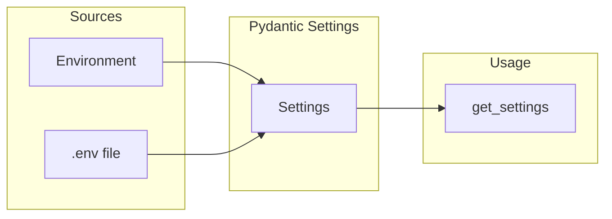

# Configuration

Gregory is configured via environment variables. When running locally, use a `.env` file in the project root (copy from `.env.example`).

## Variables

| Variable | Required | Default | Description |
|----------|----------|---------|-------------|
| `LOG_LEVEL` | No | `INFO` | Logging level: `DEBUG`, `INFO`, `WARNING`, `ERROR` |
| `OLLAMA_BASE_URL` | Yes (for chat) | — | Ollama server URL (e.g. `http://192.168.1.x:11434`) |
| `NOTES_PATH` | No | `/app/notes` | Path to the notes directory |
| `FAMILY_MEMBERS` | No | — | Comma-separated user IDs (e.g. `alice,bob,kids`) |

## Configuration Flow



## Environment Examples

**Local development:**
```bash
OLLAMA_BASE_URL=http://localhost:11434
NOTES_PATH=./notes
FAMILY_MEMBERS=alice,bob,kids
LOG_LEVEL=DEBUG
```

**Docker (Ollama on host):**
```bash
OLLAMA_BASE_URL=http://host.docker.internal:11434
NOTES_PATH=/app/notes
FAMILY_MEMBERS=alice,bob,kids
```

**Docker (Ollama on LAN):**
```bash
OLLAMA_BASE_URL=http://192.168.1.100:11434
NOTES_PATH=/app/notes
FAMILY_MEMBERS=alice,bob,kids
```
