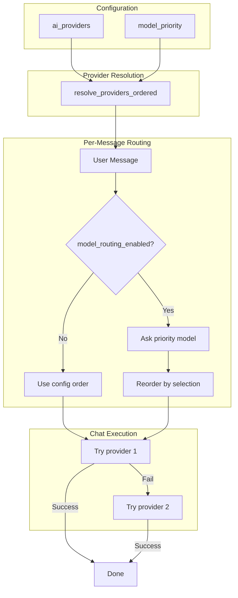
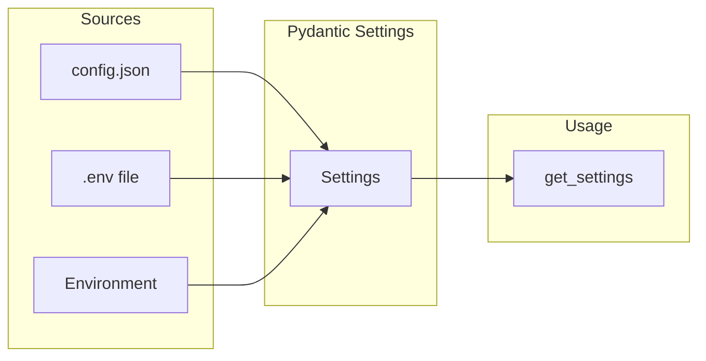

# Configuration

Gregory supports three configuration sources, in order of precedence (later overrides earlier):

1. **config.json** — For local (non-Docker) runs. Copy `config.json.example` to `config.json`.
2. **.env** — Environment file. Copy `.env.example` to `.env`.
3. **Environment variables** — Highest precedence.

When running in Docker, use `.env` or environment variables. When running locally, `config.json` is often more convenient.

**Note:** Settings are loaded once at startup. A restart is required to pick up changes to the config file, `.env`, or environment variables.

## Variables

### General

| Variable | Required | Default | Description |
|----------|----------|---------|-------------|
| `LOG_LEVEL` | No | `INFO` | Logging level: `DEBUG`, `INFO`, `WARNING`, `ERROR` |
| `NOTES_PATH` | No | `/app/notes` | Path to the notes directory |
| `FAMILY_MEMBERS` | No | — | Comma-separated user IDs (e.g. `alice,bob,kids`) |
| `CONFIG_FILE` | No | `config.json` | Path to JSON config file (for local runs) |

### AI Providers (set at least one)

| Variable | Required | Default | Description |
|----------|----------|---------|-------------|
| `OLLAMA_BASE_URL` | For Ollama | — | Ollama server URL (e.g. `http://192.168.1.x:11434`) |
| `OLLAMA_MODEL` | No | `llama3.2` | Ollama model (e.g. `llama3.2`, `mistral`) |
| `ANTHROPIC_API_KEY` | For Claude | — | Anthropic API key ([console.anthropic.com](https://console.anthropic.com)) |
| `CLAUDE_MODEL` | No | `claude-3-5-sonnet-20241022` | Claude model identifier |
| `GEMINI_API_KEY` | For Gemini | — | Google API key ([aistudio.google.com/apikey](https://aistudio.google.com/apikey)) |
| `GEMINI_MODEL` | No | `gemini-1.5-flash` | Gemini model identifier |
| `AI_PROVIDER` | No | — | Preferred provider: `claude`, `gemini`, or `ollama`. If unset, first available wins. |

### Notes Observations

| Variable | Required | Default | Description |
|----------|----------|---------|-------------|
| `OBSERVATIONS_ENABLED` | No | `false` | When `true`, Gregory appends learned facts using `[OBSERVATION: ...]` (user), `[GREGORY_NOTE: ...]` (self), `[HOUSEHOLD_NOTE: ...]`, or `[NOTE:entity: ...]` |
| `MODEL_ROUTING_ENABLED` | No | `true` | When `true`, the highest-priority model is asked which AI should handle each message before responding |
| `OLLAMA_ENSURE_MODELS` | No | `false` | When `true`, on startup Gregory pulls any configured Ollama models that are missing |
| `HEARTBEAT_REFLECTION_MINUTES` | No | `0` | Interval for self-reflection (question→answer→gregory.md). 0=disabled |
| `HEARTBEAT_NOTES_CLEANUP_MINUTES` | No | `0` | Interval for notes cleanup (random doc summarized by advanced model). 0=disabled |
| `SYSTEM_PROMPT` | No | — | Override the base system prompt. Use `\n` for newlines in JSON or .env |

## JSON Config (Local Runs)

When not running in Docker, copy `config.json.example` to `config.json` and edit:

```json
{
  "log_level": "INFO",
  "ollama_base_url": "http://localhost:11434",
  "ollama_model": "llama3.2",
  "anthropic_api_key": null,
  "claude_model": "claude-3-5-sonnet-20241022",
  "gemini_api_key": null,
  "gemini_model": "gemini-1.5-flash",
  "ai_provider": null,
  "observations_enabled": false,
  "model_routing_enabled": true,
  "ollama_ensure_models": false,
  "system_prompt": null,
  "notes_path": "./notes",
  "family_members": "alice,bob,kids",
  "memory_enabled": false,
  "memory_path": "./memory",
  "memory_similarity_threshold": 0.7,
  "memory_top_k": 3,
  "memory_embedding_provider": "default",
  "memory_embedding_model": "nomic-embed-text"
}
```

**Note:** Prefer `.env` for API keys (`ANTHROPIC_API_KEY`, `GEMINI_API_KEY`) to avoid committing secrets. Or use `api_key_env` in `ai_providers` to reference env vars.

Keys match the setting names (snake_case). The file is only loaded if it exists. Use `CONFIG_FILE` to point to a different path. See `config.json.example` in the project root for a ready-to-copy template.

## AI Providers (Multi-Endpoint, Multi-Model)

For cost control, you can define multiple Ollama URLs, Anthropic keys, and Gemini keys, each with multiple models and suitability notes. Gregory tries providers in order (Ollama first by default, since it's free).

When `ai_providers` is set, it replaces the legacy flat config for provider selection. Use `model_priority` to control which models are tried and in what order.

### Structure

```json
{
  "ai_providers": {
    "ollama": [
      {
        "url": "http://localhost:11434",
        "models": [
          { "id": "llama3.2", "notes": "Fast, general chat, free" },
          { "id": "mistral", "notes": "Better reasoning" }
        ]
      }
    ],
    "anthropic": [
      {
        "api_key": null,
        "api_key_env": "ANTHROPIC_API_KEY",
        "models": [
          { "id": "claude-3-haiku", "notes": "Cheap, simple tasks" },
          { "id": "claude-sonnet-4-6", "notes": "Premium, complex tasks only" }
        ]
      }
    ],
    "gemini": [
      {
        "api_key_env": "GEMINI_API_KEY",
        "models": [
          { "id": "gemini-1.5-flash", "notes": "Fast, cost-effective" }
        ]
      }
    ]
  },
  "model_priority": [
    { "provider": "ollama", "instance": 0, "model": "llama3.2" },
    { "provider": "gemini", "instance": 0, "model": "gemini-1.5-flash" },
    { "provider": "anthropic", "instance": 0, "model": "claude-sonnet-4-6" }
  ]
}
```

- **ollama**: `url` + `models[]` with `id` and `notes`
- **anthropic** / **gemini**: `api_key` (direct) or `api_key_env` (env var name) + `models[]`
- **model_priority**: Order to try. Without it, default is: all Ollama, then all Gemini, then all Anthropic.

### Model routing

When `model_routing_enabled` is true (default), Gregory asks the **highest-priority model** (e.g. llama3.2) which AI should handle each message before responding. The selector sees the user's message and the list of available models with their notes, then recommends one. Gregory uses that model for the actual chat, falling back to others if it fails. This reduces cost by steering simple tasks to local/free models and complex tasks to stronger models.

To minimize cost, place an Ollama model first in `model_priority`. Model selection uses the first model, so an Ollama-first order keeps selection free. Or set `model_selection_provider` to `"ollama"` to force the selector to always use Ollama for the selection call, regardless of `model_priority` order.



See [AI System](AI_SYSTEM.md) for a detailed explanation of model routing and provider fallback.

### Memory

Gregory's memory system stores daily journal files and a vector database for semantic retrieval. It is separate from the static notes system. See [MEMORY.md](MEMORY.md) for a full explanation.

| Variable | Required | Default | Description |
|----------|----------|---------|-------------|
| `MEMORY_ENABLED` | No | `false` | Master switch. When `false`, no journal files are written and no vector search runs |
| `MEMORY_PATH` | No | `/app/memory` | Directory for journal `.md` files and the ChromaDB data folder |
| `MEMORY_SIMILARITY_THRESHOLD` | No | `0.7` | Minimum cosine similarity (0–1) for a memory hit to be injected into chat context |
| `MEMORY_TOP_K` | No | `3` | Maximum number of memory hits injected per chat turn |
| `MEMORY_EMBEDDING_PROVIDER` | No | `default` | Embedding backend: `default` (onnxruntime, all-MiniLM-L6-v2) or `ollama` |
| `MEMORY_EMBEDDING_MODEL` | No | `nomic-embed-text` | Embedding model name when `MEMORY_EMBEDDING_PROVIDER=ollama` |
| `HEARTBEAT_DAILY_SUMMARY_MINUTES` | No | `0` | Interval (minutes) to summarize today's journal. 0=disabled |
| `HEARTBEAT_MEMORY_COMPRESSION_MINUTES` | No | `0` | Interval (minutes) to compress past months into `YYYY-MM.md`. 0=disabled |

**Quick start (onnxruntime embeddings):**
```bash
MEMORY_ENABLED=true
MEMORY_PATH=/app/memory
```

**With Ollama embeddings:**
```bash
MEMORY_ENABLED=true
MEMORY_PATH=/app/memory
MEMORY_EMBEDDING_PROVIDER=ollama
MEMORY_EMBEDDING_MODEL=nomic-embed-text
# OLLAMA_BASE_URL must also be set
```

### Heartbeat

When `heartbeat_reflection_minutes` or `heartbeat_notes_cleanup_minutes` is set (non-zero), Gregory runs periodic background tasks:

- **Self-reflection** (every N minutes): Gregory generates a question about himself or what he knows, answers it using his notes, and appends the result to `gregory.md`. Uses the first available provider (normal priority order).

- **Notes cleanup** (every N minutes): A random note document (household, gregory, entity, or user) is selected, sent to the **premium model** (last in `model_priority`, typically Claude/Gemini), summarized and cleaned up, then overwritten. Documents are chosen at random each cycle.

Set either to `0` to disable. Minimum interval is 1 minute.

## Configuration Flow



## Environment Examples

**Local development:**
```bash
OLLAMA_BASE_URL=http://localhost:11434
NOTES_PATH=./notes
FAMILY_MEMBERS=alice,bob,kids
LOG_LEVEL=DEBUG
```

**Docker (Ollama on host):**
```bash
OLLAMA_BASE_URL=http://host.docker.internal:11434
NOTES_PATH=/app/notes
FAMILY_MEMBERS=alice,bob,kids
```

**Docker (Ollama on LAN):**
```bash
OLLAMA_BASE_URL=http://192.168.1.100:11434
NOTES_PATH=/app/notes
FAMILY_MEMBERS=alice,bob,kids
```
