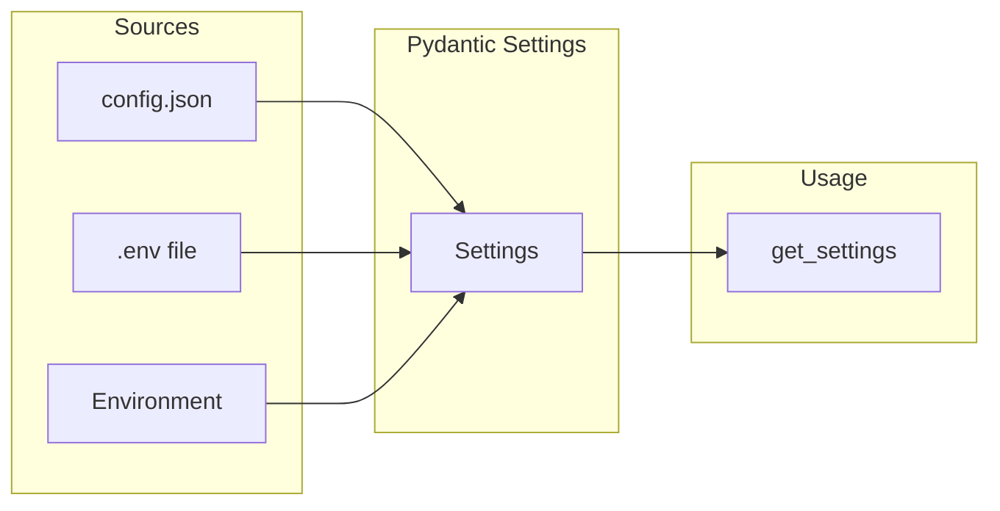

# Configuration

Gregory supports three configuration sources, in order of precedence (later overrides earlier):

1. **config.json** — For local (non-Docker) runs. Copy `config.json.example` to `config.json`.
2. **.env** — Environment file. Copy `.env.example` to `.env`.
3. **Environment variables** — Highest precedence.

When running in Docker, use `.env` or environment variables. When running locally, `config.json` is often more convenient.

## Variables

### General

| Variable | Required | Default | Description |
|----------|----------|---------|-------------|
| `LOG_LEVEL` | No | `INFO` | Logging level: `DEBUG`, `INFO`, `WARNING`, `ERROR` |
| `NOTES_PATH` | No | `/app/notes` | Path to the notes directory |
| `FAMILY_MEMBERS` | No | — | Comma-separated user IDs (e.g. `alice,bob,kids`) |
| `CONFIG_FILE` | No | `config.json` | Path to JSON config file (for local runs) |

### AI Providers (set at least one)

| Variable | Required | Default | Description |
|----------|----------|---------|-------------|
| `OLLAMA_BASE_URL` | For Ollama | — | Ollama server URL (e.g. `http://192.168.1.x:11434`) |
| `OLLAMA_MODEL` | No | `llama3.2` | Ollama model (e.g. `llama3.2`, `mistral`) |
| `ANTHROPIC_API_KEY` | For Claude | — | Anthropic API key ([console.anthropic.com](https://console.anthropic.com)) |
| `CLAUDE_MODEL` | No | `claude-3-5-sonnet-20241022` | Claude model identifier |
| `GEMINI_API_KEY` | For Gemini | — | Google API key ([aistudio.google.com/apikey](https://aistudio.google.com/apikey)) |
| `GEMINI_MODEL` | No | `gemini-1.5-flash` | Gemini model identifier |
| `AI_PROVIDER` | No | — | Preferred provider: `claude`, `gemini`, or `ollama`. If unset, first available wins. |

### Notes Observations

| Variable | Required | Default | Description |
|----------|----------|---------|-------------|
| `OBSERVATIONS_ENABLED` | No | `false` | When `true`, Gregory appends learned facts to user notes using `[OBSERVATION: ...]` format in responses |

## JSON Config (Local Runs)

When not running in Docker, copy `config.json.example` to `config.json` and edit:

```json
{
  "log_level": "INFO",
  "ollama_base_url": "http://localhost:11434",
  "ollama_model": "llama3.2",
  "anthropic_api_key": null,
  "claude_model": "claude-3-5-sonnet-20241022",
  "gemini_api_key": null,
  "gemini_model": "gemini-1.5-flash",
  "ai_provider": null,
  "observations_enabled": false,
  "notes_path": "./notes",
  "family_members": "alice,bob,kids"
}
```

**Note:** Prefer `.env` for API keys (`ANTHROPIC_API_KEY`, `GEMINI_API_KEY`) to avoid committing secrets.

Keys match the setting names (snake_case). The file is only loaded if it exists. Use `CONFIG_FILE` to point to a different path. See `config.json.example` in the project root for a ready-to-copy template.

## Configuration Flow



## Environment Examples

**Local development:**
```bash
OLLAMA_BASE_URL=http://localhost:11434
NOTES_PATH=./notes
FAMILY_MEMBERS=alice,bob,kids
LOG_LEVEL=DEBUG
```

**Docker (Ollama on host):**
```bash
OLLAMA_BASE_URL=http://host.docker.internal:11434
NOTES_PATH=/app/notes
FAMILY_MEMBERS=alice,bob,kids
```

**Docker (Ollama on LAN):**
```bash
OLLAMA_BASE_URL=http://192.168.1.100:11434
NOTES_PATH=/app/notes
FAMILY_MEMBERS=alice,bob,kids
```
