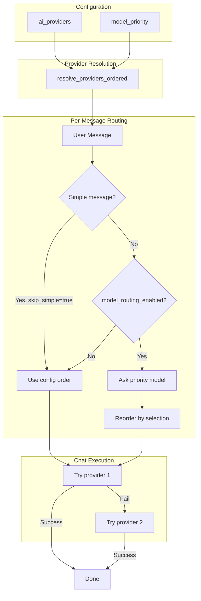
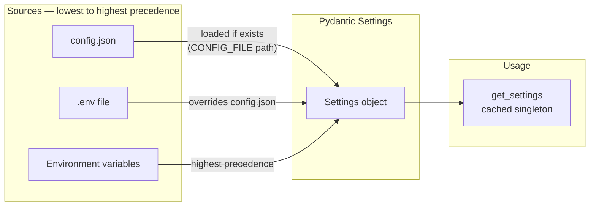

# Configuration

Gregory supports three configuration sources, in order of precedence (later overrides earlier):

1. **config.json** — For local (non-Docker) runs. Copy `config.json.example` to `config.json`.
2. **.env** — Environment file. Copy `.env.example` to `.env`.
3. **Environment variables** — Highest precedence.

When running in Docker, use `.env` or environment variables. When running locally, `config.json` is often more convenient.

**Note:** Settings are loaded once at startup. A restart is required to pick up changes to the config file, `.env`, or environment variables.

## Variables

### General

| Variable | Required | Default | Description |
|----------|----------|---------|-------------|
| `LOG_LEVEL` | No | `INFO` | Logging level: `DEBUG`, `INFO`, `WARNING`, `ERROR` |
| `NOTES_PATH` | No | `/app/notes` | Path to the notes directory |
| `FAMILY_MEMBERS` | No | — | Comma-separated user IDs (e.g. `alice,bob,kids`) |
| `CONFIG_FILE` | No | `config.json` | Path to JSON config file (for local runs) |
| `SYSTEM_PROMPT` | No | — | Override the base system prompt. Use `\n` for newlines in JSON or .env |

### AI Providers (set at least one)

| Variable | Required | Default | Description |
|----------|----------|---------|-------------|
| `OLLAMA_BASE_URL` | For Ollama | — | Ollama server URL (e.g. `http://192.168.1.x:11434`) |
| `OLLAMA_MODEL` | No | `llama3.2` | Ollama model (e.g. `llama3.2`, `mistral`) |
| `ANTHROPIC_API_KEY` | For Claude | — | Anthropic API key |
| `CLAUDE_MODEL` | No | `claude-3-5-sonnet-20241022` | Claude model identifier |
| `GEMINI_API_KEY` | For Gemini | — | Google API key |
| `GEMINI_MODEL` | No | `gemini-1.5-flash` | Gemini model identifier |
| `AI_PROVIDER` | No | — | Preferred provider: `claude`, `gemini`, or `ollama`. If unset, first available wins. |
| `PROVIDER_RETRY_COUNT` | No | `0` | Retry transient provider errors (timeout, 429, 503). Range: 0–3. Uses exponential backoff (1s, 2s, 4s). |
| `OLLAMA_ENSURE_MODELS` | No | `false` | On startup, pull any configured Ollama models that are missing |

### Model Routing

When `MODEL_ROUTING_ENABLED=true` (default), Gregory asks the highest-priority model to pick the best AI for each user message before responding. This enables cost optimization by steering simple tasks to local/free models.

| Variable | Required | Default | Description |
|----------|----------|---------|-------------|
| `MODEL_ROUTING_ENABLED` | No | `true` | Ask highest-priority model which AI to use for each message |
| `MODEL_ROUTING_SKIP_SIMPLE` | No | `true` | Skip model routing for short/simple messages (greetings, "ok", "thanks"). Saves time and cost for trivial responses. |
| `MODEL_SELECTION_PROVIDER` | No | — | Force the model selector to always use this provider (`ollama`, `anthropic`, or `gemini`). Useful to ensure selection calls are always free (Ollama). |
| `FOLLOW_UP_PREFER_OLLAMA` | No | `false` | When `true`, try Ollama first for tool follow-up calls even if the main response used a different provider. |

### Notes & Observations

| Variable | Required | Default | Description |
|----------|----------|---------|-------------|
| `OBSERVATIONS_ENABLED` | No | `false` | When `true`, Gregory appends learned facts to notes using markers: `[OBSERVATION: ...]` (user), `[GREGORY_NOTE: ...]` (self), `[HOUSEHOLD_NOTE: ...]`, `[NOTE:entity: ...]` |
| `KNOWLEDGE_ENABLED` | No | `true` | Enable `[KNOWLEDGE: title \| content]` marker so Gregory can create/update knowledge notes in `notes/knowledge/` |
| `WIKILINKS_ENABLED` | No | `true` | Enable `[[wikilink]]` resolution: linked note summaries are appended to chat context |
| `WIKILINK_DEPTH` | No | `1` | How many levels of wikilinks to follow when assembling context. 0=disabled, 1=direct links only, max 3. |

### Tools

| Variable | Required | Default | Description |
|----------|----------|---------|-------------|
| `WIKIPEDIA_ENABLED` | No | `true` | Enable Wikipedia search via `[WIKIPEDIA: query]` marker in AI responses |
| `WEB_SEARCH_ENABLED` | No | `true` | Enable web search via `[WEB_SEARCH: query]` marker (uses DuckDuckGo) |
| `FACT_CHECK_STRICT` | No | `true` | Require AI to verify health, medical, safety, legal, or financial claims before answering |
| `HA_ENABLED` | No | `false` | Enable Home Assistant integration (lights, thermostats, sensors) |
| `HA_BASE_URL` | For HA | — | Home Assistant URL (e.g. `http://192.168.0.x:8123`) |
| `HA_ACCESS_TOKEN` | For HA | — | Home Assistant long-lived access token |
| `SKILLS_ENABLED` | No | `[]` | Allowlist of skill names to enable. Empty = all enabled. E.g. `["wikipedia", "web_search"]`. Applies to both built-in and MCP skills. |

See [TOOLS.md](TOOLS.md) for tool usage and [HOME_ASSISTANT.md](HOME_ASSISTANT.md) for Home Assistant setup.

### Heartbeat

Heartbeat tasks run in the background at configurable intervals to keep Gregory's notes and memory fresh.

| Variable | Required | Default | Description |
|----------|----------|---------|-------------|
| `HEARTBEAT_REFLECTION_MINUTES` | No | `0` | Interval for self-reflection (generates a question, answers it, writes to `gregory.md`). 0=disabled |
| `HEARTBEAT_NOTES_CLEANUP_MINUTES` | No | `0` | Interval for notes cleanup: picks a random note document, cleans/summarizes it with the premium model. 0=disabled |
| `HEARTBEAT_PREMIUM_PROVIDER` | No | `last` | Which provider to use for premium tasks (cleanup, compression): `last` (most capable model in priority list), `first`, or `ollama`. |
| `HEARTBEAT_DAILY_SUMMARY_MINUTES` | No | `0` | Interval to summarize today's journal entries (requires `MEMORY_ENABLED`). Suggested: `60` or `1440`. 0=disabled |
| `HEARTBEAT_MEMORY_COMPRESSION_MINUTES` | No | `0` | Interval to compress completed months into `YYYY-MM.md` (requires `MEMORY_ENABLED`). Suggested: `10080` (weekly). 0=disabled |

Minimum interval for any heartbeat task is 1 minute.

### Memory

Gregory's memory system stores daily journal files and a vector database for semantic retrieval. See [MEMORY.md](MEMORY.md) for a full explanation.

| Variable | Required | Default | Description |
|----------|----------|---------|-------------|
| `MEMORY_ENABLED` | No | `false` | Master switch. When `false`, no journal files are written and no vector search runs |
| `MEMORY_PATH` | No | `/app/memory` | Directory for journal `.md` files and the ChromaDB data folder |
| `MEMORY_SIMILARITY_THRESHOLD` | No | `0.7` | Minimum cosine similarity (0–1) for a memory hit to be injected into chat context |
| `MEMORY_TOP_K` | No | `3` | Maximum number of memory hits injected per chat turn |
| `MEMORY_EMBEDDING_PROVIDER` | No | `default` | Embedding backend: `default` (onnxruntime, all-MiniLM-L6-v2, no extra config) or `ollama` |
| `MEMORY_EMBEDDING_MODEL` | No | `nomic-embed-text` | Embedding model name when `MEMORY_EMBEDDING_PROVIDER=ollama` |

**Quick start (onnxruntime embeddings, no extra configuration):**
```bash
MEMORY_ENABLED=true
MEMORY_PATH=/app/memory
```

**With Ollama embeddings:**
```bash
MEMORY_ENABLED=true
MEMORY_PATH=/app/memory
MEMORY_EMBEDDING_PROVIDER=ollama
MEMORY_EMBEDDING_MODEL=nomic-embed-text
# OLLAMA_BASE_URL must also be set
```

## JSON Config (Local Runs)

When not running in Docker, copy `config.json.example` to `config.json` and edit:

```json
{
  "log_level": "INFO",
  "ollama_base_url": "http://localhost:11434",
  "ollama_model": "llama3.2",
  "anthropic_api_key": null,
  "claude_model": "claude-3-5-sonnet-20241022",
  "gemini_api_key": null,
  "gemini_model": "gemini-1.5-flash",
  "ai_provider": null,
  "provider_retry_count": 0,
  "observations_enabled": false,
  "knowledge_enabled": true,
  "wikilinks_enabled": true,
  "wikilink_depth": 1,
  "model_routing_enabled": true,
  "model_routing_skip_simple": true,
  "model_selection_provider": null,
  "follow_up_prefer_ollama": false,
  "ollama_ensure_models": false,
  "system_prompt": null,
  "notes_path": "./notes",
  "family_members": "alice,bob,kids",
  "memory_enabled": false,
  "memory_path": "./memory",
  "memory_similarity_threshold": 0.7,
  "memory_top_k": 3,
  "memory_embedding_provider": "default",
  "memory_embedding_model": "nomic-embed-text",
  "heartbeat_reflection_minutes": 0,
  "heartbeat_notes_cleanup_minutes": 0,
  "heartbeat_premium_provider": "last",
  "heartbeat_daily_summary_minutes": 0,
  "heartbeat_memory_compression_minutes": 0,
  "wikipedia_enabled": true,
  "web_search_enabled": true,
  "fact_check_strict": true,
  "ha_enabled": false,
  "ha_base_url": null,
  "ha_access_token": null,
  "skills_enabled": []
}
```

**Note:** Prefer `.env` for API keys (`ANTHROPIC_API_KEY`, `GEMINI_API_KEY`) to avoid committing secrets. Or use `api_key_env` in `ai_providers` to reference env vars.

Keys match the setting names (snake_case). The file is only loaded if it exists. Use `CONFIG_FILE` to point to a different path.

## AI Providers (Multi-Endpoint, Multi-Model)

For cost control, you can define multiple Ollama URLs, Anthropic keys, and Gemini keys, each with multiple models and suitability notes. Gregory tries providers in order (Ollama first by default, since it's free).

When `ai_providers` is set, it replaces the legacy flat config for provider selection. Use `model_priority` to control which models are tried and in what order.

### Structure

```json
{
  "ai_providers": {
    "ollama": [
      {
        "url": "http://localhost:11434",
        "models": [
          { "id": "llama3.2", "notes": "Fast, general chat, free" },
          { "id": "mistral", "notes": "Better reasoning" }
        ]
      }
    ],
    "anthropic": [
      {
        "api_key": null,
        "api_key_env": "ANTHROPIC_API_KEY",
        "models": [
          { "id": "claude-3-haiku-20240307", "notes": "Cheap, simple tasks" },
          { "id": "claude-sonnet-4-6", "notes": "Premium, complex tasks only" }
        ]
      }
    ],
    "gemini": [
      {
        "api_key_env": "GEMINI_API_KEY",
        "models": [
          { "id": "gemini-1.5-flash", "notes": "Fast, cost-effective" }
        ]
      }
    ]
  },
  "model_priority": [
    { "provider": "ollama", "instance": 0, "model": "llama3.2" },
    { "provider": "gemini", "instance": 0, "model": "gemini-1.5-flash" },
    { "provider": "anthropic", "instance": 0, "model": "claude-sonnet-4-6" }
  ]
}
```

- **ollama**: `url` + `models[]` with `id` and `notes`
- **anthropic** / **gemini**: `api_key` (direct) or `api_key_env` (env var name) + `models[]`
- **model_priority**: Order to try. Without it, default is: all Ollama, then all Gemini, then all Anthropic.
- **notes**: Human-readable description of a model's strengths; shown to the model selector when choosing which AI to use

### Model routing

When `model_routing_enabled` is true (default), Gregory asks the **highest-priority model** which AI should handle each message. The selector sees the user's message and the list of available models with their `notes`, then recommends one. Gregory uses that model for the actual chat, falling back to others if it fails.

**Cost optimization tip:** Place an Ollama model first in `model_priority`. Since Ollama is free, selection calls cost nothing. Or set `model_selection_provider=ollama` to force the selector to always use Ollama regardless of priority order.


```mermaid
flowchart TB
    subgraph config [Configuration]
        AP[ai_providers]
        MP[model_priority]
    end

    subgraph resolution [Provider Resolution]
        Resolve[resolve_providers_ordered]
    end

    subgraph routing [Per-Message Routing]
        Msg[User Message]
        Simple{Simple message?}
        Select{model_routing_enabled?}
        UseConfig[Use config order]
        AskSelector[Ask priority model]
        Reorder[Reorder by selection]
    end

    subgraph execution [Chat Execution]
        Try1[Try provider 1]
        Try2[Try provider 2]
    end

    AP --> Resolve
    MP --> Resolve
    Resolve --> Msg
    Msg --> Simple
    Simple -->|Yes, skip_simple=true| UseConfig
    Simple -->|No| Select
    Select -->|No| UseConfig
    Select -->|Yes| AskSelector
    AskSelector --> Reorder
    UseConfig --> Try1
    Reorder --> Try1
    Try1 -->|Fail| Try2
    Try1 -->|Success| done[Done]
    Try2 -->|Success| done
```

See [AI System](AI_SYSTEM.md) for a detailed explanation of model routing and provider fallback.

## MCP Servers (Model Context Protocol)

Gregory can connect to external MCP servers on startup and register their tools as skills. Each tool becomes available to the AI using a `[MCP:server/tool: {"arg": "val"}]` marker.

MCP servers can be configured only via `config.json` (not environment variables):

```json
{
  "mcp_servers": [
    {
      "name": "filesystem",
      "transport": "stdio",
      "command": ["npx", "-y", "@modelcontextprotocol/server-filesystem", "/home/user/data"],
      "enabled": true
    },
    {
      "name": "my-remote-server",
      "transport": "sse",
      "url": "http://localhost:3000/sse",
      "enabled": true
    }
  ]
}
```

| Field | Description |
|-------|-------------|
| `name` | Human-readable server name; used as prefix for skill names (e.g. `filesystem/read_file`) |
| `transport` | `stdio` (local subprocess) or `sse`/`http` (remote server) |
| `command` | Command + args to launch the server (stdio only). E.g. `["npx", "-y", "@modelcontextprotocol/server-filesystem", "/path"]` |
| `url` | Server URL for SSE/HTTP transport (e.g. `http://localhost:3000/sse`) |
| `enabled` | Set to `false` to skip this server on startup without removing the config |

See [TOOLS.md](TOOLS.md#mcp-model-context-protocol) for more on the MCP skill system.

## Configuration Flow


```mermaid
flowchart LR
    subgraph sources [Sources — lowest to highest precedence]
        json[config.json]
        dotenv[.env file]
        env[Environment variables]
    end

    subgraph pydantic [Pydantic Settings]
        settings[Settings object]
    end

    subgraph usage [Usage]
        config[get_settings\ncached singleton]
    end

    json -->|"loaded if exists\n(CONFIG_FILE path)"| settings
    dotenv -->|"overrides config.json"| settings
    env -->|"highest precedence"| settings
    settings --> config
```

## Environment Examples

**Local development (Ollama only):**
```bash
OLLAMA_BASE_URL=http://localhost:11434
NOTES_PATH=./notes
FAMILY_MEMBERS=alice,bob,kids
LOG_LEVEL=DEBUG
```

**Docker (Ollama on host):**
```bash
OLLAMA_BASE_URL=http://host.docker.internal:11434
NOTES_PATH=/app/notes
FAMILY_MEMBERS=alice,bob,kids
```

**Docker (Ollama on LAN + Claude fallback):**
```bash
OLLAMA_BASE_URL=http://192.168.1.100:11434
ANTHROPIC_API_KEY=sk-ant-...
AI_PROVIDER=ollama
NOTES_PATH=/app/notes
FAMILY_MEMBERS=alice,bob,kids
```

**Full-featured production setup:**
```bash
# AI providers
OLLAMA_BASE_URL=http://192.168.1.100:11434
ANTHROPIC_API_KEY=sk-ant-...
GEMINI_API_KEY=AIza...
MODEL_ROUTING_ENABLED=true

# Notes & memory
NOTES_PATH=/app/notes
MEMORY_ENABLED=true
MEMORY_PATH=/app/memory
OBSERVATIONS_ENABLED=true
KNOWLEDGE_ENABLED=true

# Heartbeat
HEARTBEAT_REFLECTION_MINUTES=120
HEARTBEAT_NOTES_CLEANUP_MINUTES=480
HEARTBEAT_DAILY_SUMMARY_MINUTES=60
HEARTBEAT_MEMORY_COMPRESSION_MINUTES=10080

# Home Assistant
HA_ENABLED=true
HA_BASE_URL=http://192.168.0.x:8123
HA_ACCESS_TOKEN=your-token

FAMILY_MEMBERS=alice,bob,kids
```
