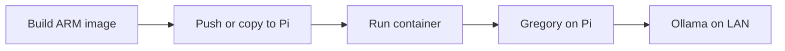
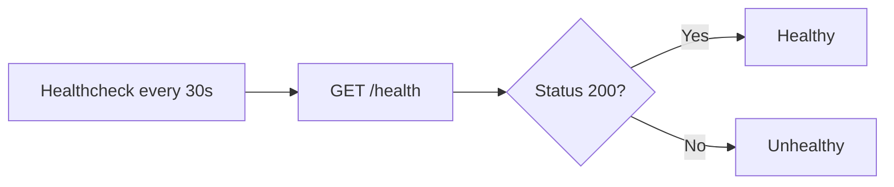

# Deployment

## Docker

### Build and Run

From the project root:

```bash
docker compose -f docker/docker-compose.yml up -d
```

Gregory listens on port 8000. Notes are stored in a Docker volume named `notes`.

### Docker Architecture

```mermaid
flowchart TB
    subgraph host [Host]
        docker[Docker Engine]
    end

    subgraph gregory_container [gregory container]
        app[Gregory App]
        notes_dir[/app/notes]
    end

    subgraph volumes [Volumes]
        notes_vol[notes volume]
    end

    subgraph external [External]
        ollama[Ollama Server]
    end

    docker --> gregory_container
    gregory_container --> notes_dir
    notes_dir --> notes_vol
    app --> ollama
```

### Using a Local Notes Directory

To mount a host directory instead of a named volume:

```yaml
volumes:
  - ./notes:/app/notes
```

### Environment File

Create `.env` in the project root:

```bash
OLLAMA_BASE_URL=http://host.docker.internal:11434
FAMILY_MEMBERS=alice,bob,kids
LOG_LEVEL=INFO
```

## Raspberry Pi

For ARM64 (e.g. Raspberry Pi 4):

```bash
docker buildx build --platform linux/arm64 -t gregory:latest -f docker/Dockerfile .
```

Or build directly on the Pi (slower):

```bash
docker build -t gregory:latest -f docker/Dockerfile .
```

### Pi Deployment Flow



## Health Check

Docker Compose includes a healthcheck:



## Production Notes

- Mount `notes/` to a persistent volume or bind mount.
- If exposed beyond the LAN, add authentication (API key or JWT) to the API.
- Ollama can run on a separate host; set `OLLAMA_BASE_URL` to its IP or hostname.
- Use `restart: unless-stopped` to restart on failure (included in default compose).
