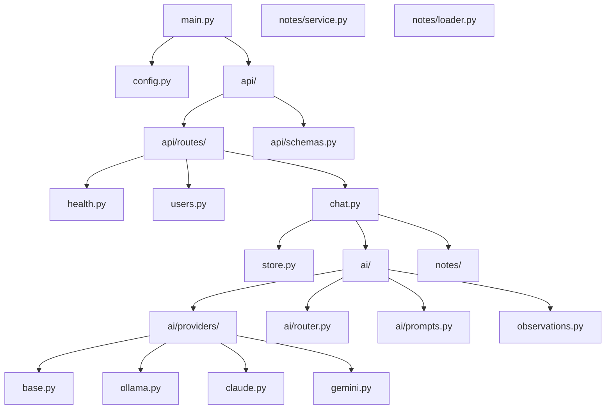

# Development

## Setup

1. Clone the repository and create a virtual environment:

```bash
python -m venv .venv
source .venv/bin/activate   # Windows: .venv\Scripts\activate
```

2. Install in editable mode with dev dependencies:

```bash
pip install -e ".[dev]"
```

3. Copy `.env.example` to `.env` and configure at least one AI provider (`OLLAMA_BASE_URL`, `ANTHROPIC_API_KEY`, or `GEMINI_API_KEY`), plus `NOTES_PATH`, `FAMILY_MEMBERS`.

## Running Locally

```bash
uvicorn gregory.main:app --reload --host 0.0.0.0 --port 8000
```

- API: http://localhost:8000

## Debug Chat UI

A minimal static HTML chat interface for testing the API is in `debug/chat.html`. Serve it via HTTP to avoid CORS:

```bash
cd debug && python -m http.server 8080
```

Open http://localhost:8080/chat.html, set the API base URL and user ID, then send messages.
- Interactive docs: http://localhost:8000/docs

## Code Structure



## Module Responsibilities

| Module | Responsibility |
|--------|----------------|
| `main.py` | FastAPI app, CORS, route mounting |
| `config.py` | Pydantic settings from environment |
| `store.py` | In-memory conversation history per user |
| `api/routes/` | HTTP handlers |
| `api/schemas.py` | Request/response Pydantic models |
| `ai/router.py` | Provider selection (Claude, Gemini, Ollama) |
| `ai/providers/` | `ollama.py`, `claude.py`, `gemini.py` |
| `ai/prompts.py` | System prompt construction |
| `ai/observations.py` | Extract `[OBSERVATION: ...]` from responses and append to notes |
| `notes/service.py` | Read/write Markdown notes |
| `notes/loader.py` | Load notes as chat context |

## Testing

Dev dependencies include `pytest` and `pytest-asyncio`. Run:

```bash
pytest
```

**Note:** Test coverage is limited. See [ROADMAP.md](ROADMAP.md) for planned improvements. When adding features, add corresponding tests in a `tests/` directory at the project root.

## Adding a New AI Provider

1. Add a class in `ai/providers/` that extends `AIProvider`.
2. Implement `async def generate(prompt, history, system_context) -> str`.
3. Update `ai/router.py` to return the new provider based on config.
4. Add corresponding environment variables in `config.py`.
