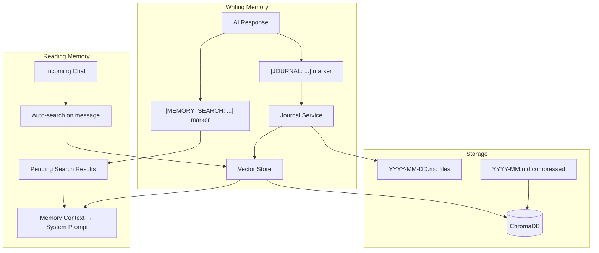
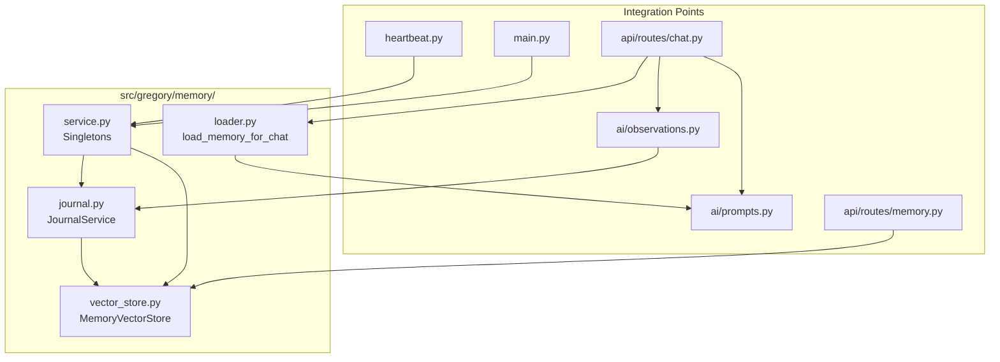

# Memory System

Gregory's memory system gives the AI a persistent, searchable journal that complements the structured notes system. Where notes hold static facts (household members, known entities, Gregory's self-description), the memory journal records events, observations, and context over time.

## Overview



## How It Works

### Writing Journal Entries

When memory is enabled, Gregory is instructed to include `[JOURNAL: ...]` markers in his responses to record events, facts, and observations worth remembering. After each AI response:

1. `extract_memory_markers()` parses the response for `[JOURNAL: text]` blocks.
2. Each entry is appended to today's journal file (`YYYY-MM-DD.md` in `MEMORY_PATH`).
3. Each entry is indexed into ChromaDB for later retrieval.

Entries are timestamped and associated with the requesting user.

**Example response with journal marker:**
```
Of course! I've set the thermostat to 22°C. [JOURNAL: Alice asked to set thermostat to 22°C at 14:30 on a Tuesday]
```

### Pre-Chat Memory Search

Before every AI call (when `MEMORY_ENABLED=true`), Gregory automatically searches the vector store with the user's incoming message as the query. Results above `MEMORY_SIMILARITY_THRESHOLD` are prepended to the system prompt as a "Relevant memories" context block:

```
## Relevant memories

[Date: 2026-01-15, User: alice] Alice prefers the thermostat at 22°C
[Date: 2026-02-01] February compressed: Alice worked from home most of February
```

### Explicit Memory Search

Gregory can search his own memory mid-conversation using `[MEMORY_SEARCH: query]` markers:

1. Gregory includes the marker in a response when he wants to recall something.
2. The system executes the search and stores results in a `_pending_results` buffer.
3. On the **next** user turn, the search results are injected into the system prompt.

**Example response with search marker:**
```
Let me check my memory for that... [MEMORY_SEARCH: Alice medication schedule]
```

### REST Search Endpoint

Clients can also query Gregory's memory directly:

```http
GET /memory/search?q=thermostat+preferences&top_k=5
```

See [API Reference](API.md#memory-search) for details.

---

## Journal File Format

### Daily Files (`YYYY-MM-DD.md`)

```markdown
# Journal 2026-02-27

- [14:23 UTC | alice] Alice asked to set thermostat to 22°C
- [15:01 UTC | bob] Bob mentioned he's staying late at work

## Summary

Alice adjusted the thermostat in the afternoon. Bob notified of a late return.
```

The `## Summary` section is written by the heartbeat daily summary task (if enabled). It is excluded from individual line indexing but indexed as a separate summary document.

### Compressed Monthly Files (`YYYY-MM.md`)

After a month ends, the heartbeat compression task replaces all daily files with a single compressed summary:

```markdown
# Memory Summary: February 2026

Key events and patterns from this month:

- Alice primarily worked from home during the first two weeks
- Thermostat preference was consistently 22°C on weekdays, 20°C on weekends
- Bob had several late evenings due to a project deadline
```

All daily entries for the month are removed from ChromaDB and the compressed file is indexed as a single document.

---

## Storage Layout

```
MEMORY_PATH/          (default: /app/memory)
├── 2026-02-25.md
├── 2026-02-26.md
├── 2026-02-27.md
├── 2026-01.md        ← compressed January
└── chroma/           ← ChromaDB persistent storage
    ├── chroma.sqlite3
    └── ...
```

---

## Configuration

Enable the memory system with `MEMORY_ENABLED=true`. See [CONFIGURATION.md](CONFIGURATION.md#memory) for all settings.

| Variable | Default | Description |
|----------|---------|-------------|
| `MEMORY_ENABLED` | `false` | Master switch for the memory system |
| `MEMORY_PATH` | `/app/memory` | Directory for journal files and ChromaDB |
| `MEMORY_SIMILARITY_THRESHOLD` | `0.7` | Minimum similarity (0–1) for auto-search results |
| `MEMORY_TOP_K` | `3` | Max results injected per chat turn |
| `MEMORY_EMBEDDING_PROVIDER` | `default` | `default` (onnxruntime) or `ollama` |
| `MEMORY_EMBEDDING_MODEL` | `nomic-embed-text` | Ollama model when provider is `ollama` |

### Embedding Providers

**Default (onnxruntime / all-MiniLM-L6-v2)**

No extra configuration required. Runs locally within the Gregory process. Suitable for most deployments.

```bash
MEMORY_EMBEDDING_PROVIDER=default
```

**Ollama (nomic-embed-text or other)**

Requires `OLLAMA_BASE_URL` to be set. The Ollama server handles embedding generation. `nomic-embed-text` is a fast, accurate embedding model.

```bash
MEMORY_EMBEDDING_PROVIDER=ollama
MEMORY_EMBEDDING_MODEL=nomic-embed-text
OLLAMA_BASE_URL=http://localhost:11434
```

---

## Memory Compression

When `HEARTBEAT_MEMORY_COMPRESSION_MINUTES` is set (non-zero), Gregory periodically compresses completed months:

1. Finds months that have daily `.md` files but no `YYYY-MM.md` compressed file.
2. Reads all daily files for the month.
3. Calls the premium AI model to produce a concise monthly summary.
4. Writes `YYYY-MM.md`.
5. Deletes the individual daily files.
6. Removes daily vector entries from ChromaDB and indexes the compressed summary.

The current (incomplete) month is never compressed.

---

## Heartbeat Tasks

| Variable | Default | Description |
|----------|---------|-------------|
| `HEARTBEAT_DAILY_SUMMARY_MINUTES` | `0` | Interval to summarize today's journal. 0=disabled |
| `HEARTBEAT_MEMORY_COMPRESSION_MINUTES` | `0` | Interval to compress past months. 0=disabled |

**Suggested values:**

```bash
HEARTBEAT_DAILY_SUMMARY_MINUTES=60       # Summarize every hour
HEARTBEAT_MEMORY_COMPRESSION_MINUTES=1440  # Compress once per day
```

---

## Startup Reindex

On startup (when `MEMORY_ENABLED=true`), Gregory reindexes all existing journal files into ChromaDB. This operation is idempotent (uses upsert), so it is safe across restarts. It runs as a background task and does not block startup.

---

## System Prompt Integration

When memory context is available, it is injected before the notes section in the system prompt:

```
## Relevant memories

[Date: 2026-02-26, User: alice] Alice asked about dinner options
[Date: 2026-02-27] ...

## Notes: alice

...
```

Gregory is also given instructions about when and how to write journal entries and trigger memory searches. These instructions appear at the end of the system prompt when `memory_enabled=True`.

---

## Architecture: Memory Module



### `journal.py` — JournalService

Manages reading and writing Markdown journal files on disk:

- `append_entry(text, for_date, user_id)` — appends a timestamped bullet to the daily file
- `read_date(date)` / `read_today()` / `read_month(year, month)` — reads file content
- `write_summary(date, summary)` — writes/replaces the `## Summary` section
- `write_compressed(year, month, content)` / `delete_daily_files_for_month(year, month)` — compression support
- `list_journal_dates()` / `list_months_with_daily_files()` — enumerate existing files

### `vector_store.py` — MemoryVectorStore

Wraps ChromaDB with an async interface:

- `index_entry(doc_id, text, entry_date, user_id, entry_type)` — upsert a document
- `search(query, n_results, threshold)` — semantic similarity search
- `delete_entries_for_month(year, month)` — delete all entries for a month
- `index_compressed_month(year, month, summary_text)` — index a monthly summary
- `reindex_all(journal_service)` — full rebuild from disk (idempotent)

All ChromaDB operations are synchronous; they are dispatched via `asyncio.run_in_executor` to avoid blocking the event loop.

### `service.py` — Singletons

Module-level singleton instances of `JournalService` and `MemoryVectorStore`. Provides:

- `write_journal_entry(text, user_id, for_date)` — convenience wrapper
- `startup_reindex()` — called by `main.py` on startup
- `get_journal_service()` / `get_vector_store()` — accessor functions

### `loader.py` — Chat Context

Assembles memory context for injection into system prompts:

- `load_memory_for_chat(user_id, message, vector_store)` — runs auto-search and returns formatted context
- `set_pending_memory_results(user_id, results)` / `pop_pending_memory_results(user_id)` — manage deferred `[MEMORY_SEARCH:]` results
