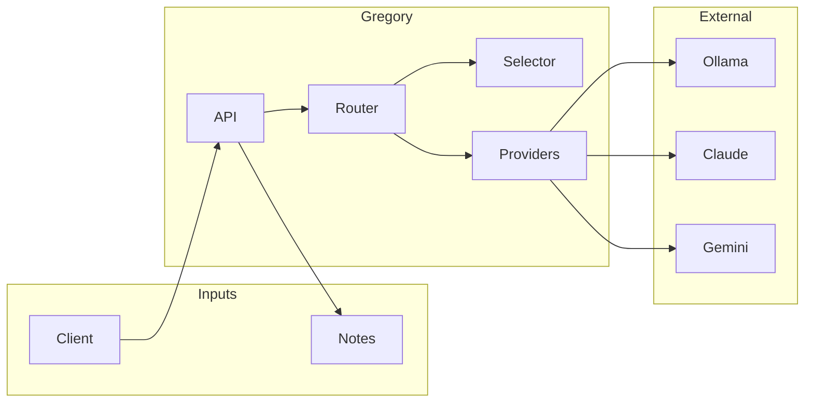

# Gregory Documentation

Documentation for Gregory, the Smart House AI.

## Documentation Index

| Document | Description |
|----------|-------------|
| [Architecture](ARCHITECTURE.md) | System design, components, and data flow |
| [AI System](AI_SYSTEM.md) | Model routing, provider selection, and fallback |
| [API Reference](API.md) | Detailed HTTP API specification |
| [Configuration](CONFIGURATION.md) | Environment variables and settings |
| [Development](DEVELOPMENT.md) | Local setup, testing, and code structure |
| [Deployment](DEPLOYMENT.md) | Docker, Raspberry Pi, and production deployment |
| [Troubleshooting](TROUBLESHOOTING.md) | Common issues and solutions |
| [Roadmap](ROADMAP.md) | Planned features and integrations |

## Concepts at a Glance

## Quick Links

- **Debug Chat UI**: `debug/chat.html` — Static HTML interface for testing. Serve with `python -m http.server 8080` from the `debug/` directory.
