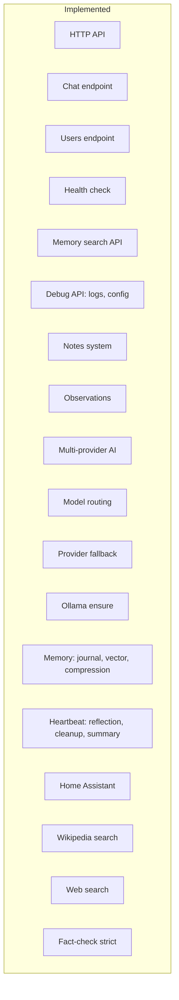

# Implementation Status

Current status of Gregory features. See [ROADMAP.md](ROADMAP.md) for planned work.

## Implemented

| Category | Features |
|----------|----------|
| **API** | HTTP API, chat, users, health, memory search, debug (logs, config) |
| **Notes** | Household, per-user, Gregory, entities, services; observations |
| **AI** | Multi-provider (Ollama, Claude, Gemini), model routing, fallback, Ollama ensure |
| **Memory** | Journal, ChromaDB vector store, daily summary, monthly compression |
| **Heartbeat** | Self-reflection, notes cleanup, daily summary, memory compression |
| **Tools** | Home Assistant, Wikipedia, Web Search, fact-check strict |

## Not Implemented

| Feature | Notes |
|---------|-------|
| **Jellyfin** | Media library, playback control |
| **Webhooks / triggers** | External systems triggering Gregory |
| **Persistent web app** | Beyond debug chat UI |
| **Voice interface** | Speech-to-text, text-to-speech |
| **Conversation persistence** | Chat history lost on restart |
