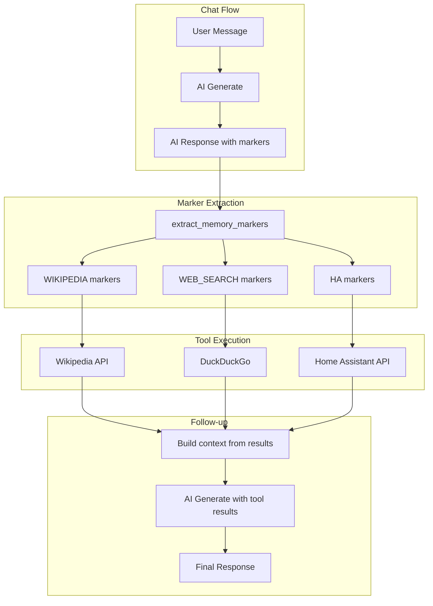

# Tools

Gregory can invoke external tools during chat. When the AI includes special markers in its response, the system executes the corresponding tool and optionally performs a follow-up AI call with the results.

## Overview

## Wikipedia

When `wikipedia_enabled=true` (default), Gregory can search Wikipedia using the `[WIKIPEDIA: query]` marker.

**How it works:** The AI includes `[WIKIPEDIA: search query]` in its response when it needs factual information. The system calls the Wikipedia API, retrieves matching article snippets, and injects them into a follow-up AI call so Gregory can answer with verified information.

**Configuration:** `wikipedia_enabled` (default: `true`)

**Example:** User asks "What is the capital of France?" — AI may emit `[WIKIPEDIA: capital of France]` — system fetches Wikipedia content — AI responds with the answer using the fetched data.

---

## Web Search

When `web_search_enabled=true` (default), Gregory can search the web using the `[WEB_SEARCH: query]` marker.

**How it works:** The AI includes `[WEB_SEARCH: search query]` in its response when it needs current or external information. The system uses DuckDuckGo (ddgs) to search, then injects results into a follow-up AI call.

**Configuration:** `web_search_enabled` (default: `true`)

**Example:** User asks "What's the latest news on X?" — AI emits `[WEB_SEARCH: latest news X]` — system runs web search — AI summarizes results for the user.

---

## Fact-check Strict

When `fact_check_strict=true` (default), Gregory is instructed to verify health, medical, safety, legal, or financial claims before answering. He will use `[WIKIPEDIA: ...]` or `[WEB_SEARCH: ...]` markers to look up authoritative sources when such topics arise.

**Configuration:** `fact_check_strict` (default: `true`)

---

## Home Assistant

When `ha_enabled=true`, Gregory can interact with Home Assistant to control lights, read sensor states, and call services.

**Markers:**
- `[HA_LIST]` or `[HA_LIST: domain]` — List entities
- `[HA_FIND: name]` — Find entities by friendly name
- `[HA_STATE: entity_id]` — Get current state
- `[HA_SERVICE: domain.service | key=val | ...]` — Call a service

**Configuration:** `ha_enabled`, `ha_base_url`, `ha_access_token`

See [HOME_ASSISTANT.md](HOME_ASSISTANT.md) for full setup and usage.
