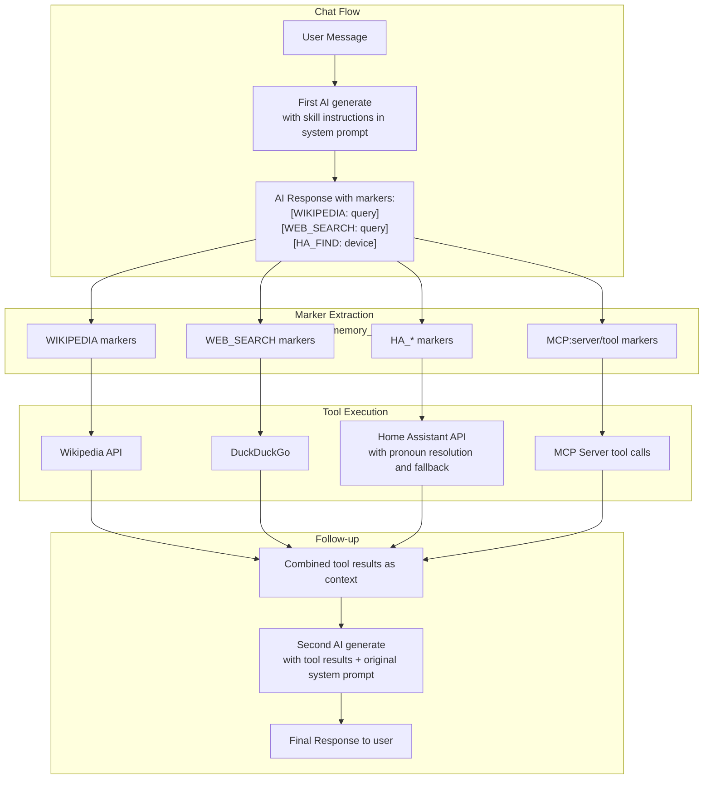
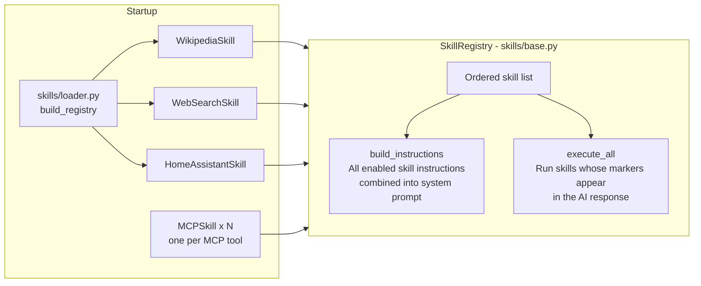

# Tools & Skills

Gregory can invoke external tools during chat using a marker-based system. When the AI includes special markers in its response, the system executes the corresponding tool, then performs a follow-up AI call with the results so Gregory can answer immediately with real data.

## How Skills Work

Gregory uses an extensible **Skill Registry** that is built on startup. Each skill:

1. **Declares a marker pattern** — a regex that the AI embeds in its response (e.g. `[WIKIPEDIA: query]`)
2. **Injects instructions** into the system prompt so the AI knows when and how to use the skill
3. **Executes** when its marker appears in an AI response, returning formatted context
4. **Triggers a follow-up AI call** so Gregory can give an immediate, informed answer


```mermaid
flowchart TB
    subgraph chat [Chat Flow]
        UserMsg[User Message]
        AICall1[First AI generate\nwith skill instructions in system prompt]
        AIResp["AI Response with markers:\n[WIKIPEDIA: query]\n[WEB_SEARCH: query]\n[HA_FIND: device]"]
    end

    subgraph extract [Marker Extraction\nextract_memory_markers]
        Wiki[WIKIPEDIA markers]
        Web[WEB_SEARCH markers]
        HA[HA_* markers]
        MCP_m[MCP:server/tool markers]
    end

    subgraph tools [Tool Execution]
        WikiTool[Wikipedia API]
        WebTool[DuckDuckGo]
        HATool[Home Assistant API\nwith pronoun resolution and fallback]
        MCPTool[MCP Server tool calls]
    end

    subgraph followup [Follow-up]
        Context[Combined tool results as context]
        AICall2[Second AI generate\nwith tool results + original system prompt]
        FinalResp[Final Response to user]
    end

    UserMsg --> AICall1
    AICall1 --> AIResp
    AIResp --> Wiki & Web & HA & MCP_m
    Wiki --> WikiTool
    Web --> WebTool
    HA --> HATool
    MCP_m --> MCPTool
    WikiTool & WebTool & HATool & MCPTool --> Context
    Context --> AICall2
    AICall2 --> FinalResp
```

---

## Built-in Skills

### Wikipedia

When `wikipedia_enabled=true` (default), Gregory can search Wikipedia using the `[WIKIPEDIA: query]` marker.

**When the AI uses it:** The AI is instructed to search Wikipedia before making factual claims about dates, places, events, or any verifiable fact it is less than 95% certain about. The goal is accuracy over conversational smoothness.

**How it works:**
1. AI embeds `[WIKIPEDIA: search query]` at the end of its response
2. System calls the Wikipedia API, retrieves article summaries (up to 3 results)
3. Results are injected into a follow-up AI call
4. Gregory provides an answer grounded in the fetched content

**Configuration:** `WIKIPEDIA_ENABLED` (default: `true`)

**Example:**
```
User: When did the Sydney Opera House open?
Gregory: [WIKIPEDIA: Sydney Opera House opening date]
→ fetches Wikipedia → answers with verified date
```

---

### Web Search

When `web_search_enabled=true` (default), Gregory can search the web using the `[WEB_SEARCH: query]` marker.

**When the AI uses it:** For current events, recent news, product information, or anything too new or dynamic for Wikipedia.

**How it works:**
1. AI embeds `[WEB_SEARCH: search query]`
2. System runs a DuckDuckGo search, fetches top 5 result snippets
3. Results are injected into a follow-up AI call
4. Gregory summarizes the results for the user

**Configuration:** `WEB_SEARCH_ENABLED` (default: `true`)

**Example:**
```
User: What's the current price of petrol?
Gregory: [WEB_SEARCH: current petrol price Singapore 2026]
→ fetches DuckDuckGo results → answers with current data
```

---

### Fact-Check Strict

When `fact_check_strict=true` (default), Gregory is given an additional instruction that makes Wikipedia/web search **mandatory** for health, medical, safety, legal, or financial topics. Gregory will not guess on these topics.

**Configuration:** `FACT_CHECK_STRICT` (default: `true`)

**Topics that trigger mandatory verification:**
- Medications, dosages, drug interactions
- Medical advice, diagnoses, treatment recommendations
- Safety procedures (choking, poisoning, emergency first aid)
- Legal or financial advice

---

### Home Assistant

When `ha_enabled=true`, Gregory can interact with Home Assistant to read sensor states, control lights, and call services.

**Markers:**
- `[HA_FIND: query]` — Search entities by friendly name (use first when device name is known)
- `[HA_LIST]` or `[HA_LIST: domain]` — List all entities, optionally filtered by domain
- `[HA_STATE: entity_id]` — Get current state of an entity
- `[HA_SERVICE: domain.service | key=value | ...]` — Call a Home Assistant service

**Advanced features:**
- **Pronoun resolution** — If the user says "turn it on" after controlling a device, Gregory infers which device was last mentioned and generates the correct HA_FIND marker
- **Fallback on 404** — If an entity_id is not found, Gregory automatically searches by friendly name to find the correct ID
- **Auto-execute** — If HA_FIND returns exactly one match and the user intent is clear (turn on/off), Gregory automatically calls the service without asking for confirmation

**Configuration:** `HA_ENABLED`, `HA_BASE_URL`, `HA_ACCESS_TOKEN`

See [HOME_ASSISTANT.md](HOME_ASSISTANT.md) for full setup, usage, and troubleshooting.

---

## MCP (Model Context Protocol)

Gregory supports the [Model Context Protocol](https://modelcontextprotocol.io/) for connecting to external tool servers. Each tool exposed by an MCP server is wrapped as an **MCPSkill** and registered in the skill registry alongside the built-in skills.

### How MCP Skills Work


```mermaid
flowchart TB
    subgraph startup [Startup - mcp/client.py]
        MCPManager[MCPClientManager]
        Connect["Connect to each\nenabled MCP server\n(stdio or SSE/HTTP)"]
        Discover[Discover available tools\nvia session.list_tools]
        Wrap[Wrap each tool as MCPSkill\nmcp/skill.py]
        Register[Register in SkillRegistry]
    end

    subgraph runtime [Runtime]
        AI["AI response includes:\n[MCP:server/tool: {arg: val}]"]
        Execute[MCPSkill.execute\nParses JSON args]
        Call[session.call_tool\ntool_name + parsed args]
        Result[MCP result formatted as context]
        Followup[Follow-up AI call with results]
    end

    MCPManager --> Connect --> Discover --> Wrap --> Register
    AI --> Execute --> Call --> Result --> Followup
```

### MCP Marker Syntax

The AI invokes MCP tools using this marker format:

```
[MCP:server_name/tool_name: {"arg1": "value1", "arg2": "value2"}]
```

For example, if you have a `filesystem` MCP server with a `read_file` tool:
```
[MCP:filesystem/read_file: {"path": "/home/user/notes.txt"}]
```

The system prompt for each enabled MCP tool is automatically generated from its schema, describing its parameters and usage to the AI.

### Transports

| Transport | Use Case | Config Fields |
|-----------|----------|--------------|
| `stdio` | Local MCP servers started as subprocesses | `command: ["npx", "-y", "@mcp/server-name"]` |
| `sse` / `http` | Remote MCP servers over HTTP | `url: "http://localhost:3000/sse"` |

### Configuration

MCP servers are configured in `config.json`:

```json
{
  "mcp_servers": [
    {
      "name": "filesystem",
      "transport": "stdio",
      "command": ["npx", "-y", "@modelcontextprotocol/server-filesystem", "/home/user"],
      "enabled": true
    },
    {
      "name": "my-server",
      "transport": "sse",
      "url": "http://localhost:3000/sse",
      "enabled": true
    }
  ]
}
```

See [CONFIGURATION.md](CONFIGURATION.md#mcp-servers-model-context-protocol) for full configuration reference.

---

## Knowledge Notes

The `[KNOWLEDGE: title | content]` marker lets Gregory permanently save substantive information to `notes/knowledge/*.md`. This is distinct from `[OBSERVATION:]` (which saves personal/household facts) — knowledge notes store factual reference material.

**When Gregory uses it:**
- After a Wikipedia or web search surfaces facts worth preserving for future conversations
- When a user shares detailed technical or factual information
- When learning something specific that isn't captured in regular notes

**Example:**
```
[KNOWLEDGE: Hume MRT Station | Opened in 2026 on the Downtown Line, serving the Bukit Timah area. Source: Wikipedia.]
```

**Configuration:** `KNOWLEDGE_ENABLED` (default: `true`)

---

## Skill Registry

The skill registry is a central list of all available skills. It is built once at startup by `skills/loader.py` and shared across all chat requests.


```mermaid
flowchart LR
    subgraph startup [Startup]
        Build[skills/loader.py\nbuild_registry]
        Wiki[WikipediaSkill]
        Web[WebSearchSkill]
        HA[HomeAssistantSkill]
        MCP_Skills[MCPSkill x N\none per MCP tool]
    end

    subgraph registry [SkillRegistry - skills/base.py]
        List[Ordered skill list]
        Instructions[build_instructions\nAll enabled skill instructions\ncombined into system prompt]
        Execute[execute_all\nRun skills whose markers appear\nin the AI response]
    end

    Build --> Wiki & Web & HA --> registry
    MCP_Skills --> registry
    List --> Instructions
    List --> Execute
```

**Skills allowlist:** Set `SKILLS_ENABLED=["wikipedia", "web_search"]` in `config.json` to enable only specific skills. Empty list (default) enables all skills. This applies to both built-in and MCP skills.

---

## Summary of All Markers

| Marker | Category | Description |
|--------|----------|-------------|
| `[WIKIPEDIA: query]` | Tool | Search Wikipedia for factual information |
| `[WEB_SEARCH: query]` | Tool | Search DuckDuckGo for current/dynamic information |
| `[HA_FIND: name]` | Tool | Find Home Assistant entities by friendly name |
| `[HA_LIST]` / `[HA_LIST: domain]` | Tool | List all or domain-filtered HA entities |
| `[HA_STATE: entity_id]` | Tool | Get current state of a HA entity |
| `[HA_SERVICE: domain.service \| key=val]` | Tool | Call a Home Assistant service |
| `[MCP:server/tool: {json}]` | Tool | Call a tool on a connected MCP server |
| `[KNOWLEDGE: title \| content]` | Persistence | Save factual information to knowledge notes |
| `[JOURNAL: text]` | Memory | Write a journal entry to daily memory file |
| `[MEMORY_SEARCH: query]` | Memory | Search journal memory for past context |
| `[OBSERVATION: text]` | Notes | Append observation to current user's notes |
| `[GREGORY_NOTE: text]` | Notes | Append to Gregory's self-notes (gregory.md) |
| `[HOUSEHOLD_NOTE: text]` | Notes | Append to household notes (household.md) |
| `[NOTE:entity: text]` | Notes | Append to a named entity's notes (entities/entity.md) |
