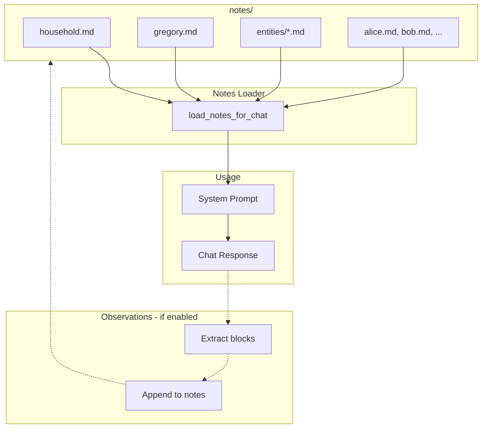

# Notes Directory

Markdown notes loaded as system context before each chat.

## File Structure

| File / Folder | Purpose |
|---|---|
| `household.md` | Shared household context (schedules, rules) |
| `gregory.md` | Gregory's self-notes — experiences, thoughts, preferences |
| `entities/*.md` | Notes about things (e.g. `dog.md`, `house.md`, `garden.md`) |
| `{user_id}.md` | Per-user notes (e.g. `alice.md`, `bob.md`) — preferences, reminders |

Filenames are sanitized: alphanumeric, `-`, and `_` only. Empty or missing files are ignored.

## Flow



## Observations

When `OBSERVATIONS_ENABLED=true`, Gregory can append to notes using these block types:

| Block | Target |
|---|---|
| `[OBSERVATION: ...]` | User note |
| `[GREGORY_NOTE: ...]` | `gregory.md` |
| `[HOUSEHOLD_NOTE: ...]` | `household.md` |
| `[NOTE:entity: ...]` | `entities/{entity}.md` |

## Examples

**`household.md`**
```markdown
# Household
- Dog feeding: 7am and 6pm
- Trash day: Tuesday
```

**`gregory.md`**
```markdown
# Gregory
- Prefers concise answers unless asked to elaborate
- Has learned the family prefers informal tone
```

**`entities/dog.md`**
```markdown
# Dog
- Name: Max
- Loves bacon treats
```

**`alice.md`**
```markdown
# Alice
- Prefers reminders for morning meetings
- Allergic to nuts
```

## See Also

- [CONFIGURATION.md](../docs/CONFIGURATION.md) — `NOTES_PATH` setting
- [ARCHITECTURE.md](../docs/ARCHITECTURE.md) — data flow details
